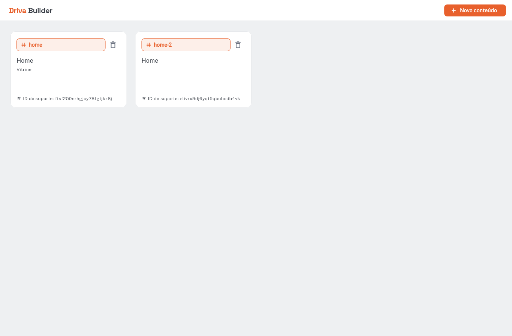
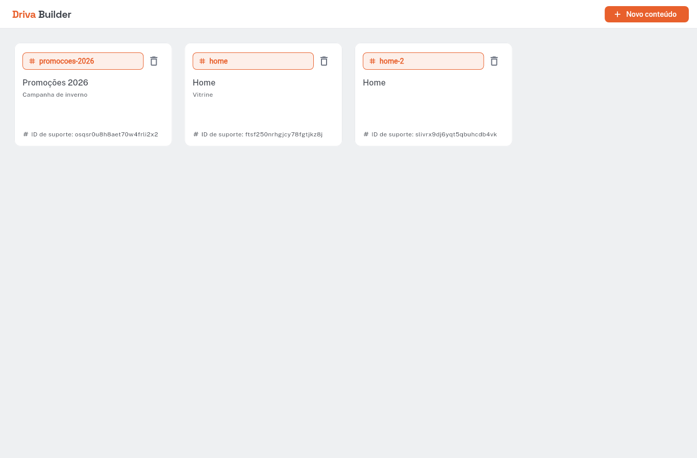
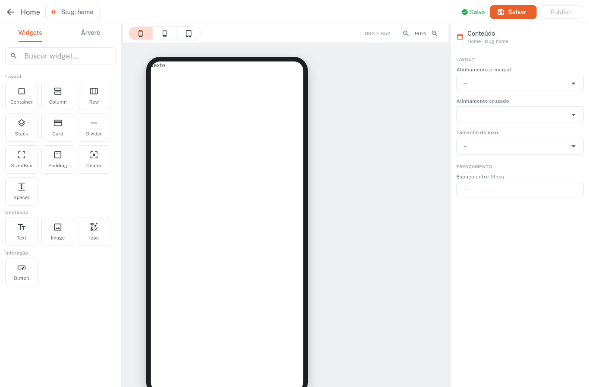
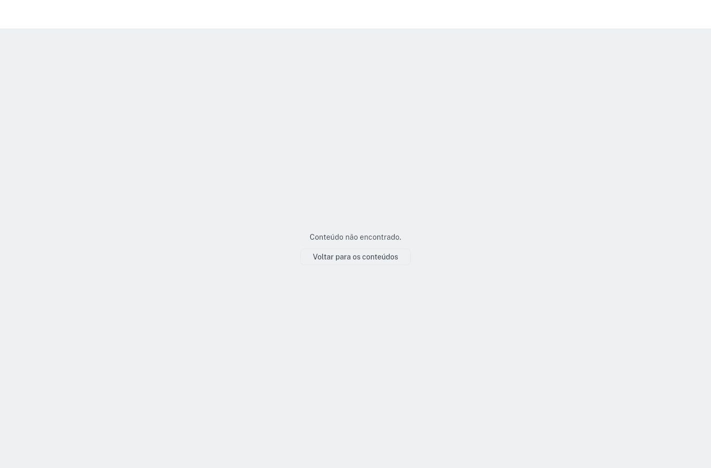
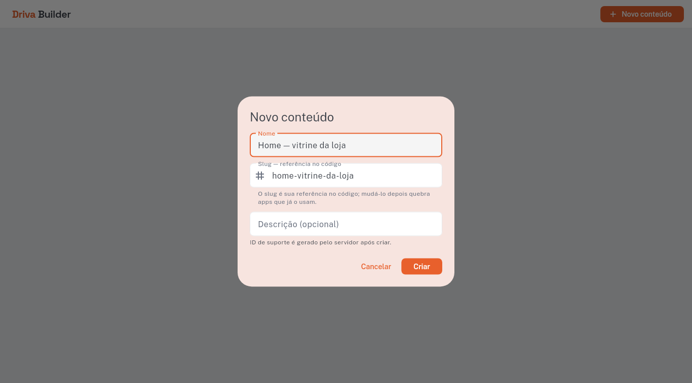
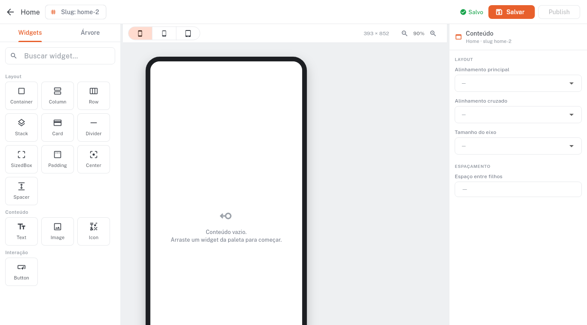
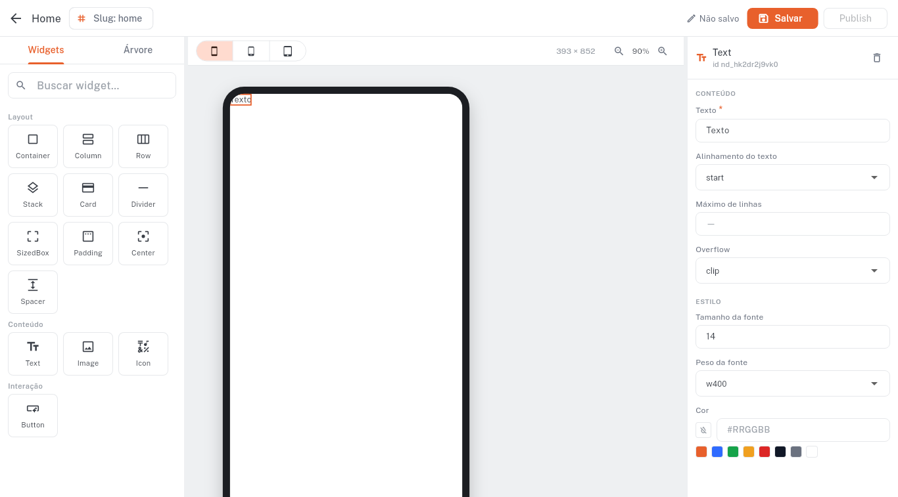
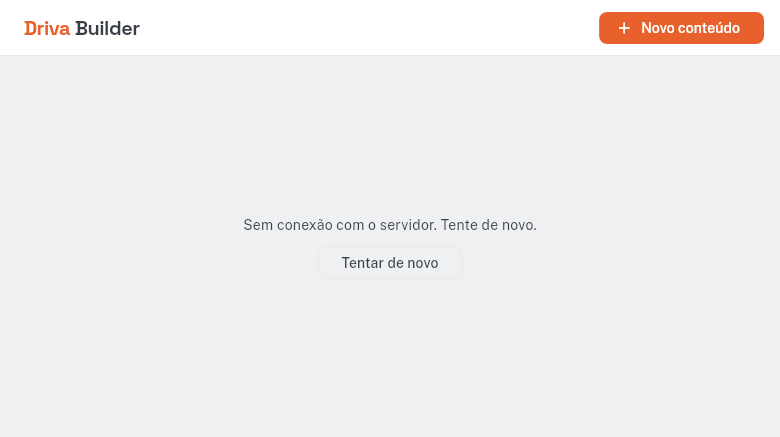

# Rodada 04 — E2E visual (Conteúdos)

> Prints **gerados pelo QA** (headless, sem intervenção manual). O dev só **confere**.
> Backend validado à parte pelo `e2e.sh` (contrato **17/17**). Aqui é só o visual.
>
> Como regerar: `docs/02-conteudos/e2e.sh` → `docs/02-conteudos/e2e_shots.sh 04` → `docs/02-conteudos/e2e.sh down`.
> 01–04 são capturados por URL; 05–08 dirigindo o canvas por CDP (`e2e_drive.mjs`).

## Estados por URL

### 01 — Lista vazia
Rota `/contents` **sem `#`** (path URL strategy). Empty state com ícone, textos e CTA.
Verifica: navegação limpa, estado `ContentListEmpty`, ícones renderizando.

### 02 — Lista com conteúdos
Cards com **slug em destaque** (badge `#`), nome, descrição e o **"ID de suporte"** (CUID2).
Verifica: `ContentListLoaded`, o slug como referência do dev, o `id` como ID de suporte, ícone de lixeira.

### 03 — Editor carregado
Editor de um conteúdo real (`/contents/:id/edit`): paleta (14 primitivos), canvas com moldura de device, inspector.
Verifica: render do editor, **toda a paleta com ícones**, inspector derivado do catálogo.

### 04 — NotFound tratado
`/contents/nao-existe/edit` → tela de "Conteúdo não encontrado" com volta à lista, **sem crash**.
Verifica: `NotFoundFailure` tratada, rota de erro amigável.

## Estados de interação (dirigidos por CDP)

### 05 — Slug derivado ao vivo
Diálogo "Novo conteúdo": digitar o **Nome** `Home — vitrine da loja` deriva o **slug** `home-vitrine-da-loja` em tempo real (sanitiza acento, espaço→hífen, minúsculas).
Verifica: derivação ao vivo + validação `^[a-z][a-z0-9-]*$`.

### 06 — Colisão de slug → `home-2`
Submeter um slug já em uso: o app **auto-resolve para `home-2`** e abre o editor (comportamento aceito pelo dev; bate com o PRD §Exceções). Backend devolveu `409 + suggestedSlug`; o cliente auto-resolveu.
Verifica: unicidade por projeto + `ConflictFailure` + sugestão.

### 07 — Drag-drop → preview
Arrastar o widget **Text** da paleta para o canvas: o preview renderiza ("Texto") e o inspector abre as props do nó. Topo indica "Não salvo".
Verifica: drag-and-drop, render do preview via renderer real, inspector.

### 08 — Salvar → "Salvo"
Após **Salvar**, o indicador muda para **"Salvo"** (verde).
Verifica: persistência do rascunho + estado visual de salvo.

## Verificação extra — modo `flutter run` (debug/DDC)

Reproduzido o cenário exato do dev (`flutter run` debug, não release), em Chrome novo:
os **ícones renderizam** (o `+` no botão está limpo). Confirma que **debug e release
estão corretos** — tofu de ícone que apareça num `flutter run` local é **estado sujo
do browser** (cache/SW/ambiente), não bug de código/build. (Aqui o backend não estava
no ar, por isso o estado de erro "Sem conexão".)

