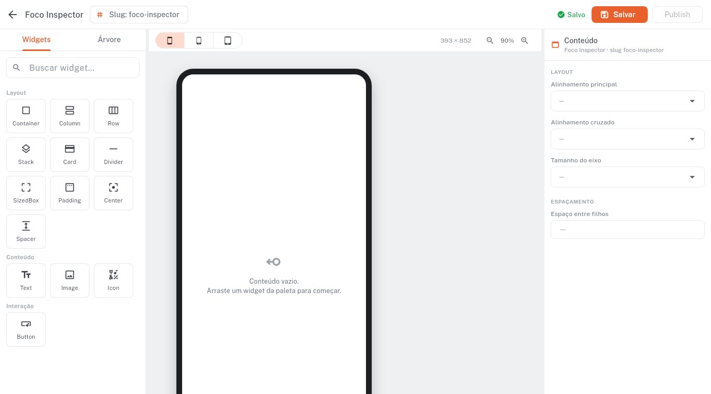
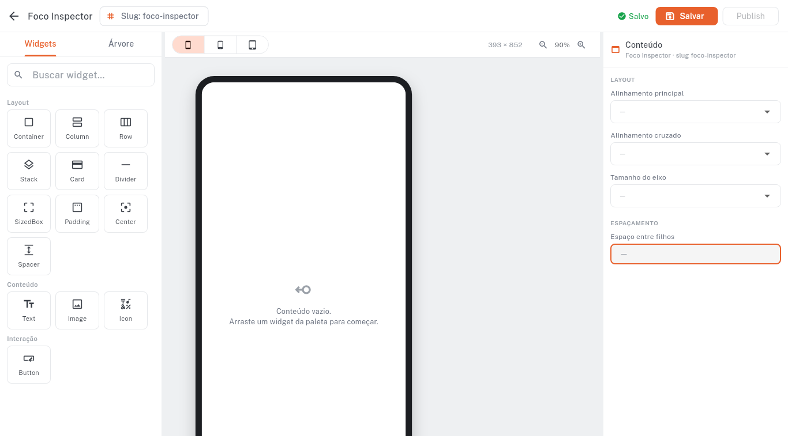

# Rodada 02 — E2E visual (Foco no Inspector)

> Prints headless gerados pelo QA. O dev só confere. Bug: digitar numa
> propriedade perdia o foco a cada tecla (só o 1º dígito colava).

### Editor aberto
/contents/:id/edit; Inspector do root column à direita, com 'Espaço entre filhos'.

### Campo focado
Clique no campo numérico 'Espaço entre filhos' — cursor ativo.

### Digitou '10'
Após digitar 1 e 0 char-a-char, o campo mostra '10' (foco NÃO caiu — antes só '1' colava).

### Digitou '105'
Terceiro dígito acumula: '105'. Prova definitiva de foco contínuo.

