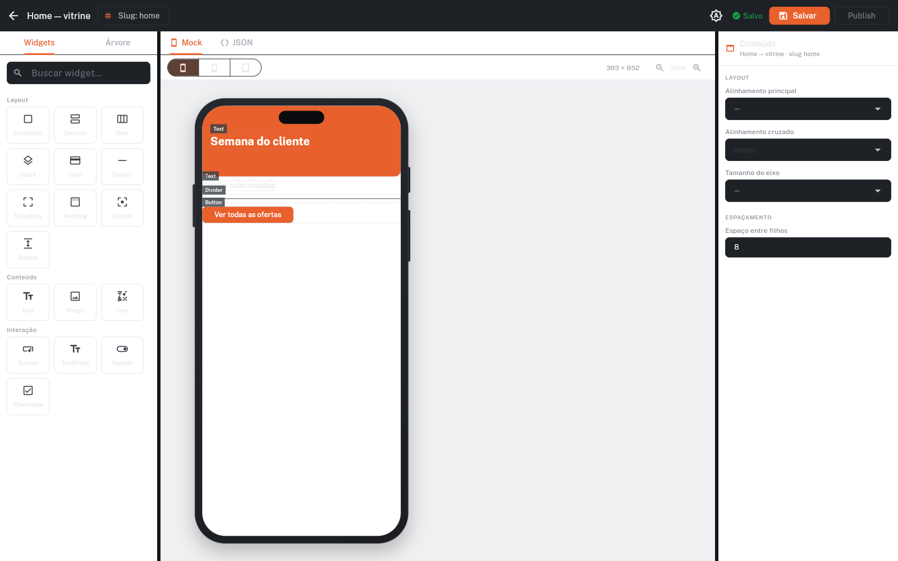
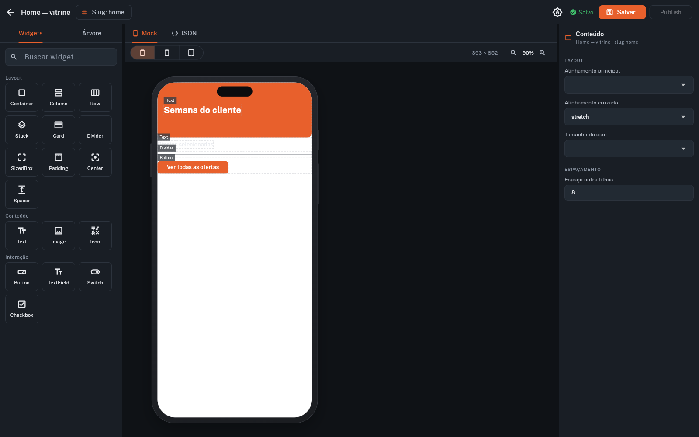
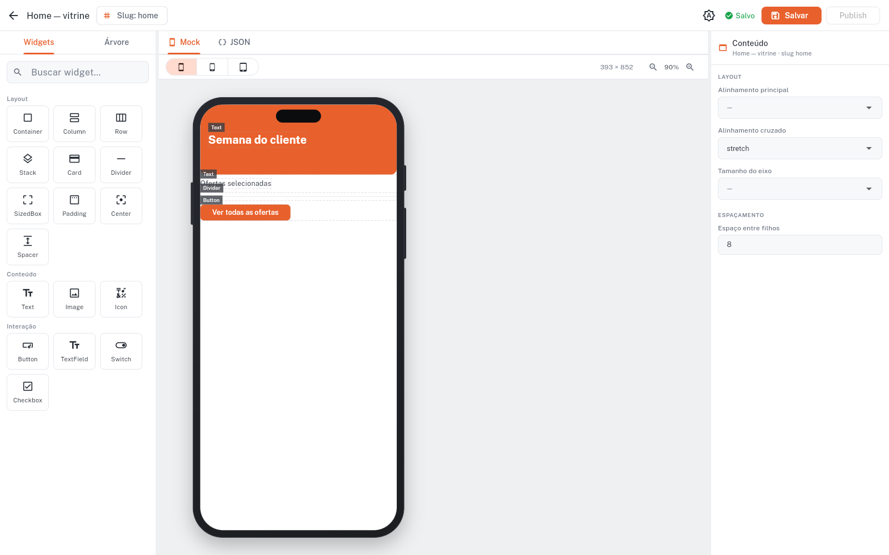
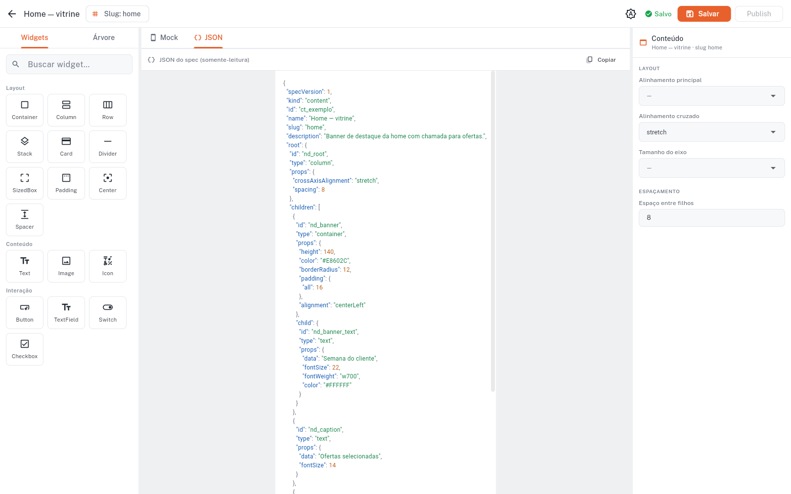
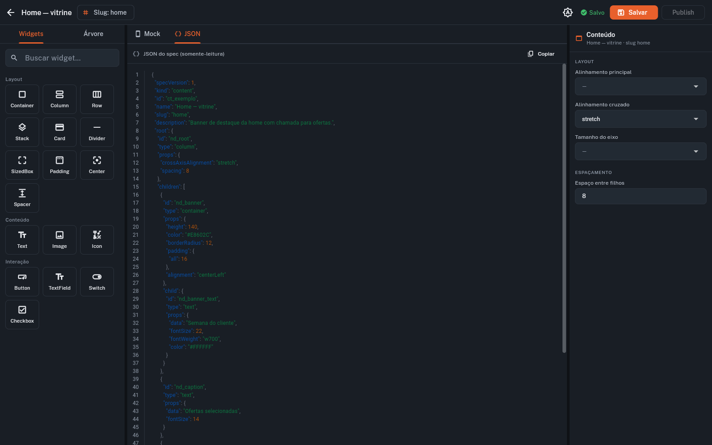
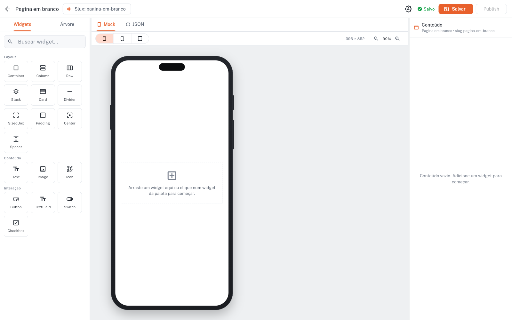
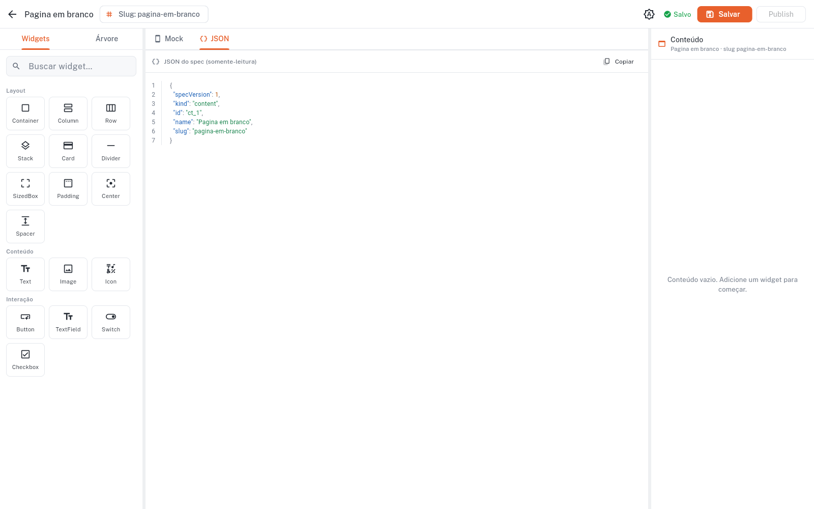
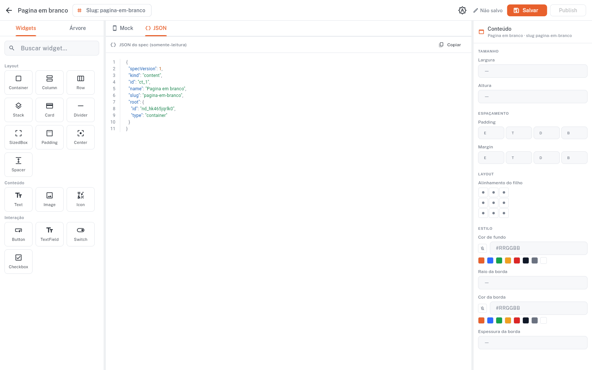
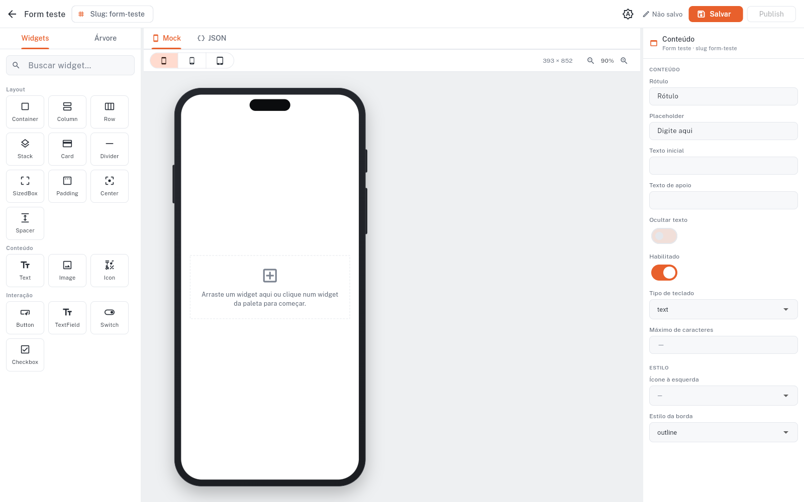

# Relatório — Ajustes de UX no editor (rodada 01)

Correções e melhorias a partir dos problemas que você encontrou no editor (hml). **5 PRs**, todos mergeados em `develop` (verde: `flutter analyze` limpo + 35 testes `sdui_core` + 12 `sdui_flutter` + 87 `driva_editor`).

**Método:** testei cada PR eu mesmo, headless — `flutter build web` em modo fake + Chrome dirigido por **Playwright**, capturando os prints deste relatório. Cada problema virou 1 PR.

| # | PR | Problema | Estado |
|---|----|----------|--------|
| 1 | [#28](https://github.com/euclidesgc/driva/pull/28) | Temas claro/escuro horríveis, dark ilegível | ✅ mergeado |
| 2 | [#29](https://github.com/euclidesgc/driva/pull/29) | Painel JSON estreito | ✅ mergeado |
| 3 | [#30](https://github.com/euclidesgc/driva/pull/30) | `column` fixa imposta na raiz | ✅ mergeado |
| 4 | [#31](https://github.com/euclidesgc/driva/pull/31) | Teto de altura do mock desnecessário; faltava hover | ✅ mergeado |
| 5 | [#32](https://github.com/euclidesgc/driva/pull/32) | `textField` com poucas props | ✅ mergeado |

---

## 1. Temas theme-aware + paleta acessível — PR #28

**Causa raiz:** ~45 usos de cores da UI eram `static const` em `AppTheme` (`surface`, `canvas`, `ink…`, `border`…), fixados na paleta clara — **não reagiam ao `themeMode`**. Por isso o dark herdava painéis/backdrop/labels claros. Bônus: a troca de tema (`ThemeCubit`) estava correta, mas um agente chegou a quebrá-la hardcodando `themeMode: system` — **peguei no teste, antes de mergear.**

**Solução:** `EditorColors` (`ThemeExtension`, 9 tokens theme-aware: `canvasBackdrop`, `panel`, `panelAlt`, `inkPrimary/Secondary/Muted`, `border`, `primaryTint`, `success`), instâncias light/dark, registrado no tema. Todos os widgets passam a ler as cores do `context`. Paleta recalibrada para **WCAG AA** (texto ≥ 4.5:1; muted ≥ 4.0:1).

Antes (dark) — backdrop claro atrás do mock, labels da paleta apagados:

Depois (dark) — backdrop escuro coeso, labels legíveis, profundidade:

Depois (light) — limpo e nítido:

> O seletor de tema é o menu **"Ⓐ"** no topo-direito (claro/escuro/sistema, persistido). Verifiquei a cadeia botão → `ThemeCubit.setMode` → `MaterialApp.themeMode`: **funciona**.

---

## 2. Painel JSON: largura + números de linha — PR #29

**Causa:** o `Column` do painel usava `crossAxisAlignment` no default (`center`) — o corpo era dimensionado ao conteúdo e **centralizado**, com faixas vazias nas laterais.

**Solução:** `crossAxisAlignment: stretch` (preenche a largura) + **gutter de números de linha** alinhado ao código.

Antes — coluna estreita centralizada:

Depois — largura cheia + números de linha:

> Realces avançados (destacar chave-pai, casar `{`/`}` no cursor, dobrar seções) ficaram no **roadmap item 8b**.

---

## 3. Raiz livre — sem `column` imposta — PR #30

Seu pedido: nada de widget fixo na página; **tela vazia = JSON vazio**; o usuário escolhe o 1º widget (que vira a raiz e pode ter seu próprio padding etc.). Isso exigiu **mudar o kernel**: `ContentSpec.root` virou opcional (`SduiNode?`), o schema deixou de exigir `column`, e a regra foi atualizada no `CLAUDE.md`. Renderer, editor (estado-vazio + "add 1º widget vira raiz"), backend e fake store acompanharam.

Página nova → tela vazia com convite ("Arraste um widget…"):

JSON correspondente — **sem `root`**:

Após adicionar um Container pela paleta — ele **vira a raiz** (qualquer tipo, não uma `column`), já selecionado e editável:

> Regressão conferida: o conteúdo existente (com árvore) continua renderizando igual.

---

## 4. Canvas: teto de altura revertido + hover — PR #31

Como você percebeu, o **zoom** já resolve o mock caber; o teto de altura só encolhia o dispositivo em janelas baixas. **Revertido** — o mock volta à altura natural, encaixe por zoom + rolagem. As **molduras realistas** e o **glow** de drag-over foram preservados. Adicionei **realce no hover** dos nós (contorno laranja sutil, 40%), como no FlutterFlow.

Hover sobre o nó "Ofertas selecionadas" (contorno leve ao redor do texto sob o cursor):

> Sobre trocar as molduras custom pelo package `device_frame` (o do widgetbook): dá para adotar, mas exigiria retrabalhar nossos overlays de seleção/drop/tag — recomendei **manter o custom** por ora (fica como opção de roadmap).

---

## 5. `textField` com props abrangentes — PR #32

Sua diretriz: props ricas como o FlutterFlow. **Descoberta:** os editores de propriedade **já são componentizados por tipo** (`FieldKind` → editor reutilizável: enum→dropdown, número, cor→swatch, spacing→T/L/R/B, alignment→grid, ícone→picker). Então bastou **enriquecer o descriptor** do `textField` — zero UI nova:

- `filled` (bool) → **`borderStyle`** (enum: `outline`/`underline`/`filled`)
- **`keyboardType`** (enum), **`maxLength`** (int), **`prefixIcon`** (ícone)

Inspector de um `textField` (raiz), com as props novas renderizadas pelos editores existentes:

> Os **estados avançados** que você destacou (contrair→presets; "set from variable"/binding) são uma feature de UX maior — registrados no **roadmap item 9b** para um esforço dedicado, em vez de meia-boca aqui.

---

## Follow-ups (registrados)

- **[bug menor]** Um widget-folha como raiz (ex.: `textField` sozinho) mostra o estado-vazio no canvas em vez de renderizar o próprio widget — quirk da lógica de empty-state (interação com a raiz livre). A adicionar no roadmap.
- **roadmap 8b** — legibilidade avançada do JSON.
- **roadmap 9b** — editores de propriedade avançados (estados múltiplos + binding).
- **catálogo** — segurado por ora (a pedido), até a base de edição amadurecer.
- **Marco 3 (categorias)** — aguarda PRD, após os bugs (agora feitos).

## Estado final

`develop` em `37c6f1a`, sincronizado com origin, **analyze limpo + 134 testes verdes**, 0 PRs abertos, branches podadas. Pronto para seu review dos PRs #28–#32 e para a próxima frente.
