# Rodada 01 — E2E do item 38 (destravar o construtor)

> Prints **gerados pelo QA** (headless, via CDP, contra a homologação real). O dev
> humano **confere** — não opera o browser. Cada gesto do roteiro da §10 do
> `plan.md` foi executado na tela e o **spec resultante foi conferido por API**.

**Resultado das asserções:** 28 PASS / 0 FAIL

## Como regerar

```bash
docs/15-destravar-construtor/e2e_hml.sh          # contrato por API (idempotente)
docs/15-destravar-construtor/e2e_shots.sh 01     # estes prints, na rodada 01
```

Os dois criam um único conteúdo de teste no projeto `default` do hml e o apagam no
fim. Nada sobra em homologação; nada disso vai para produção.

## O que o script NÃO consegue provar (é o seu roteiro)

Está em [`roteiro_e2e_humano.md`](../../roteiro_e2e_humano.md): o `Ctrl+G` sem o
Chrome reagir é o caso que teste nenhum pega — teclado sintético não passa pelo
mesmo caminho do teclado real.

## Estados capturados

### Página vazia

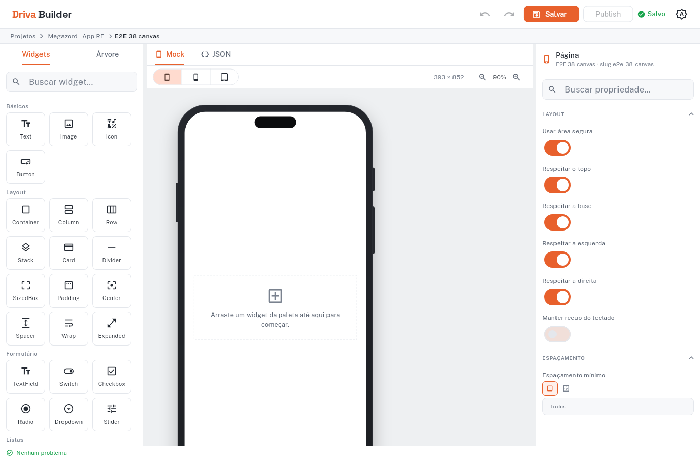

- **O script já provou:** spec sem `root` (GET /contents/:id)
- **Só o seu olho prova:** canvas com o convite "Arraste um widget da paleta até aqui" e o rodapé da árvore dizendo "Solte um widget aqui para começar"

### Text vira a raiz

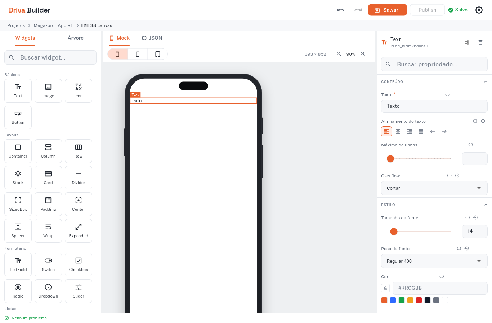

- **O script já provou:** root.type == "text"
- **Só o seu olho prova:** o Text aparece no canvas E na árvore; o inspector abre no nó recém-criado

### Drop agrupa em vez de recusar


- **O script já provou:** root virou column[text,image]
- **Só o seu olho prova:** a barra de status explica: "Text não recebia esse widget — os dois foram agrupados numa Column."

### Um único Ctrl+Z


- **O script já provou:** depois de UM Ctrl+Z o spec é `text` — não `column[text]`: wrap+drop são uma entrada só
- **Só o seu olho prova:** o canvas mostra só o Text; o botão de refazer fica habilitado

### Ctrl+Y refaz


- **O script já provou:** root voltou a column[text,image]
- **Só o seu olho prova:** o Image reaparece no canvas e na árvore

### Menu "Envolver em…"

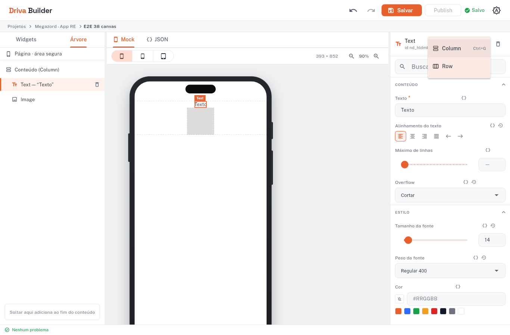

- **O script já provou:** o botão de envolver existe no cabeçalho do inspector
- **Só o seu olho prova:** o menu abre com Column (mostrando "Ctrl+G") e Row

### Envolver em Row

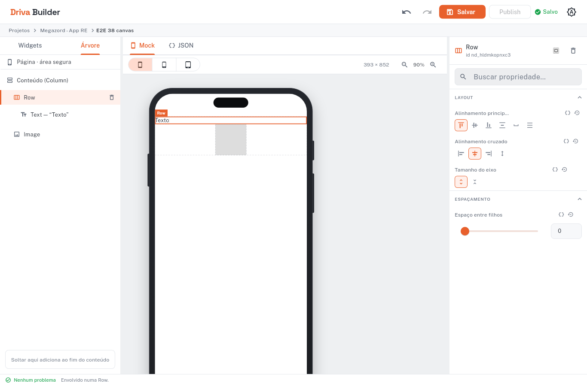

- **O script já provou:** o nó apontado virou row[text] e o Image ficou onde estava (D3)
- **Só o seu olho prova:** a Row fica selecionada no inspector logo após o comando, e a barra diz "Envolvido numa Row."

### Ctrl+G envolve

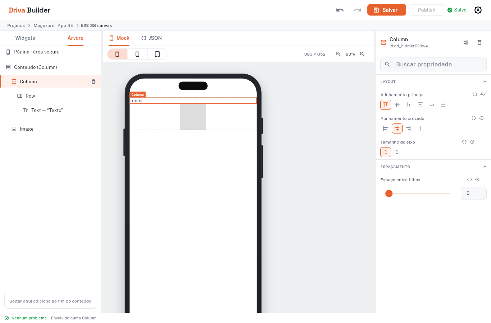

- **O script já provou:** Ctrl+G disparou o mesmo wrap do botão, em column
- **Só o seu olho prova:** a barra de status diz "Envolvido numa Column." — e o Chrome não reagiu (isto o script NÃO prova: ver H1 do roteiro humano)

### Ctrl+G inerte no campo

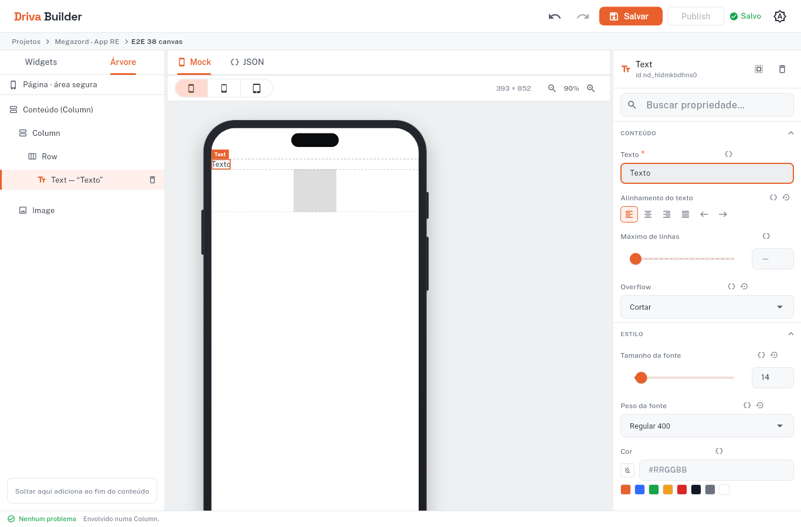

- **O script já provou:** com o cursor no campo "Texto", Ctrl+G não alterou o spec
- **Só o seu olho prova:** o campo continua com o cursor e nada muda na árvore

### Drop na linha da árvore

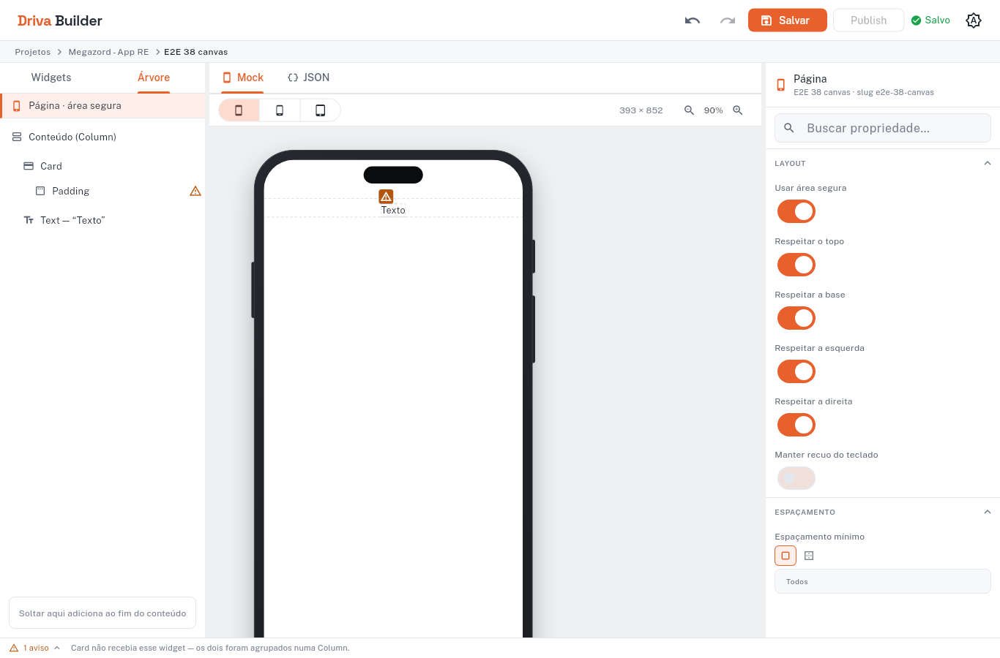

- **O script já provou:** arrastar o Text sobre o Card (cadeia sem slot livre) produziu column[card(padding), text] — o painel da árvore usa a mesma regra do canvas
- **Só o seu olho prova:** a linha da árvore acende como alvo durante o arraste e a barra explica o agrupamento

### Drop no rodapé da árvore

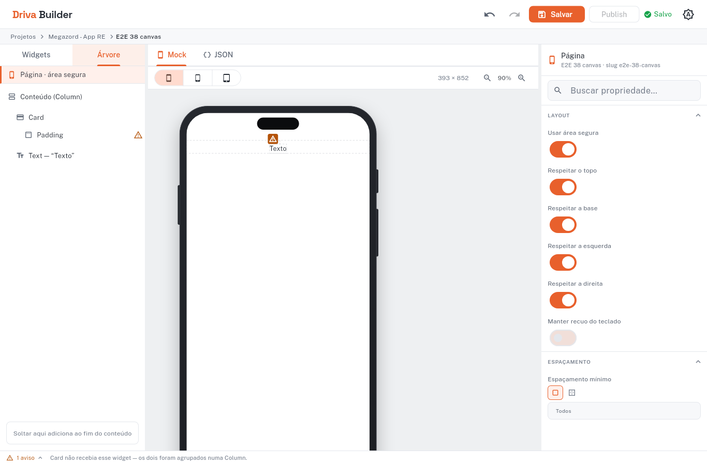

- **O script já provou:** arrastar do canvas para o rodapé deu o mesmo column[card(padding), text]
- **Só o seu olho prova:** o rodapé diz "Soltar aqui adiciona ao fim do conteúdo" e acende no arraste

### Drop sobre o nó do canvas

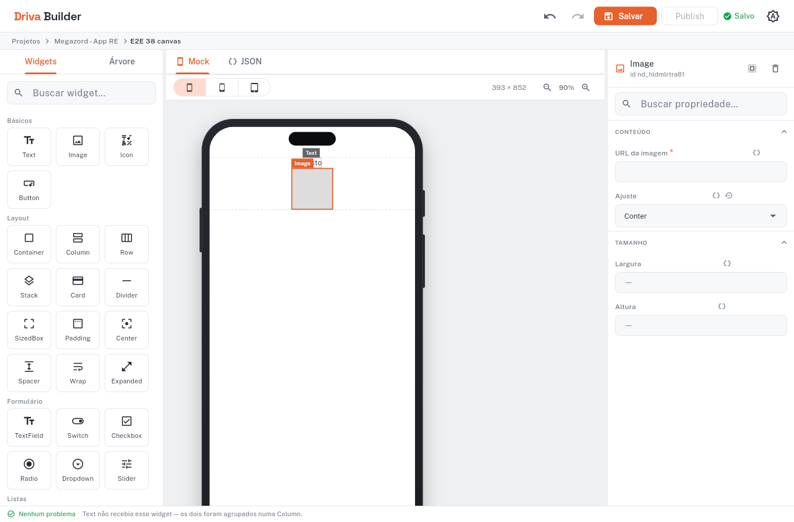

- **O script já provou:** soltar o tile em cima do próprio nó (e não no vazio) deu o mesmo column[text,image]
- **Só o seu olho prova:** o nó do canvas acende como alvo durante o arraste

### Colar agrupa

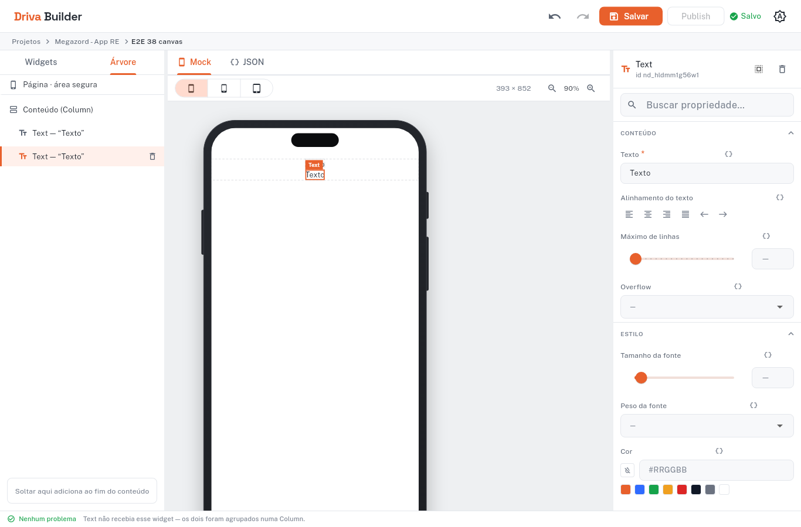

- **O script já provou:** Ctrl+V sobre raiz folha produziu column[text,text] — não emite mais recusa
- **Só o seu olho prova:** a barra de status explica o agrupamento em vez de reclamar

### Erro marcado no canvas

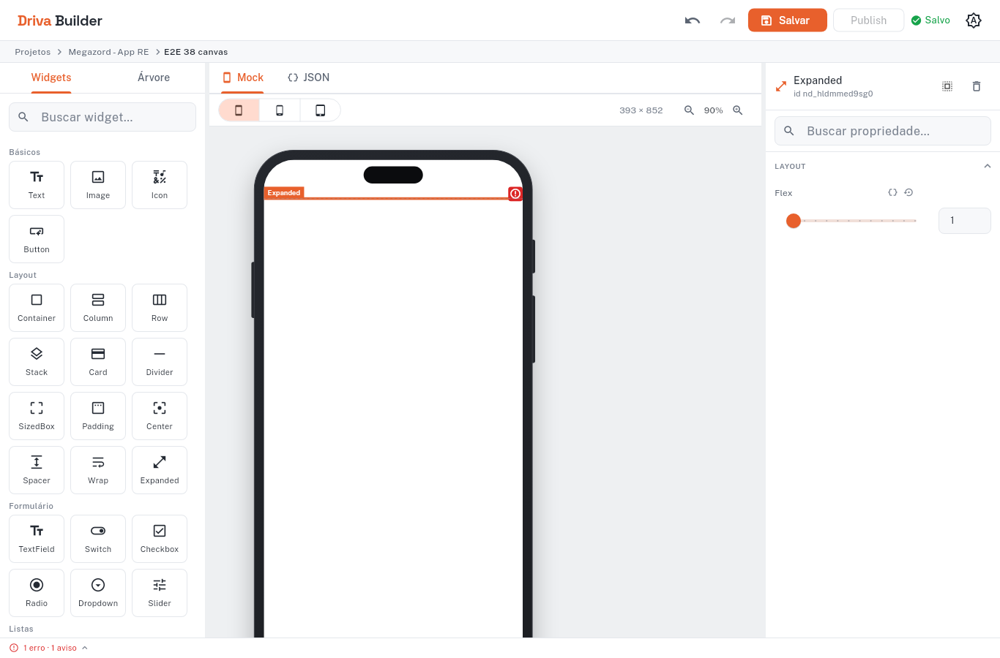

- **O script já provou:** o expanded caiu fora de Row/Column e o conteúdo passou a ter 1 erro · 1 aviso
- **Só o seu olho prova:** o selo vermelho aparece no canto do nó **no canvas**; como este expanded ainda não tem filho, ele desenha com altura zero e o selo flutua — limitação conhecida (§5 › F5), não é bug

### Erro e aviso na barra

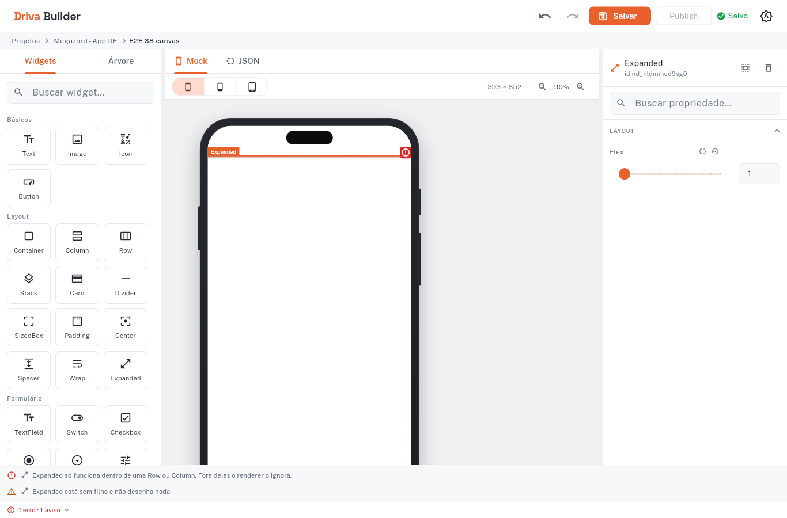

- **O script já provou:** o resumo abre a lista de problemas do conteúdo
- **Só o seu olho prova:** erro e aviso se distinguem por ÍCONE + TEXTO, não só por cor ("1 erro · 1 aviso")

### Erro marcado na árvore

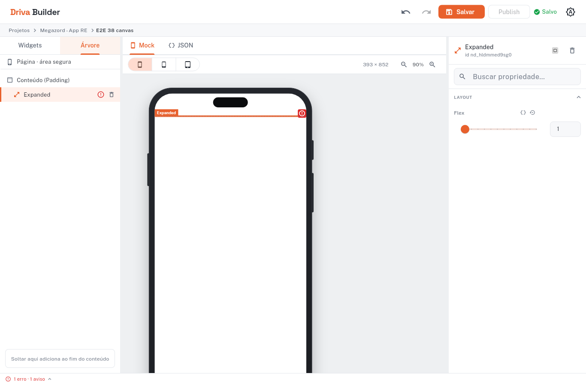

- **O script já provou:** a linha da árvore do Expanded carrega a mensagem do erro e a do aviso
- **Só o seu olho prova:** o ícone fica na linha, antes da lixeira; a marcação existe nos DOIS painéis, não só no rodapé

### Selo ancorado no nó do canvas

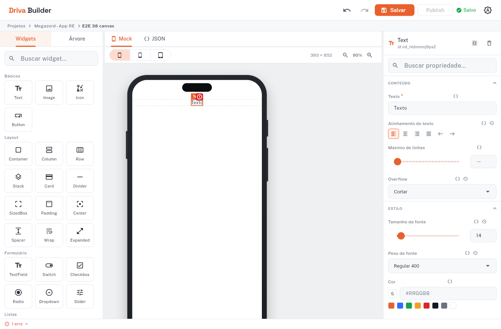

- **O script já provou:** com o expanded desenhando (agora tem filho), o selo de erro aparece preso ao nó, no canvas
- **Só o seu olho prova:** o selo fica no topo-direito do nó e convive com o rótulo do nó, à esquerda — os dois na mesma faixa (§5 › F5)

### A marcação some ao corrigir

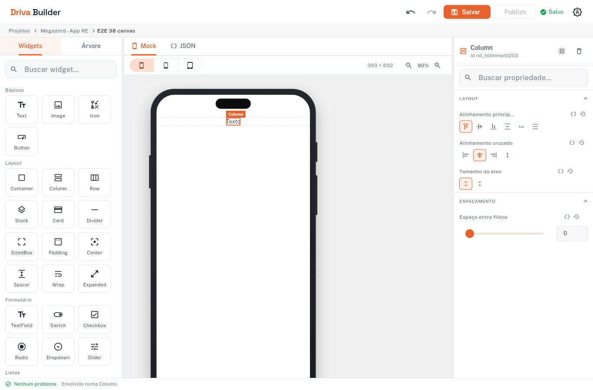

- **O script já provou:** depois do Ctrl+G o expanded está dentro de uma Column e nenhuma marcação de erro sobrou — nem na árvore, nem no canvas
- **Só o seu olho prova:** a barra de status volta para "Nenhum problema"

### Rótulo na linha da árvore

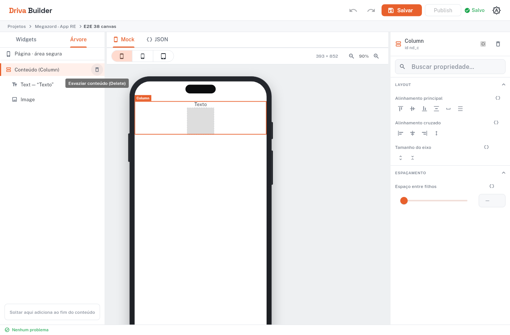

- **O script já provou:** a lixeira da raiz existe na linha da árvore
- **Só o seu olho prova:** o tooltip diz "Esvaziar conteúdo (Delete)" — e não "Remover bloco"

### Rótulo no inspector

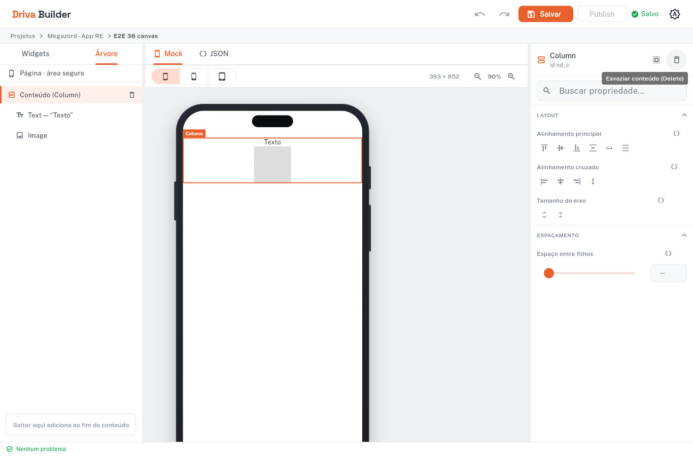

- **O script já provou:** a lixeira da raiz existe no cabeçalho do inspector
- **Só o seu olho prova:** o tooltip diz "Esvaziar conteúdo (Delete)" — o mesmo texto dos dois lados

### Conteúdo esvaziado

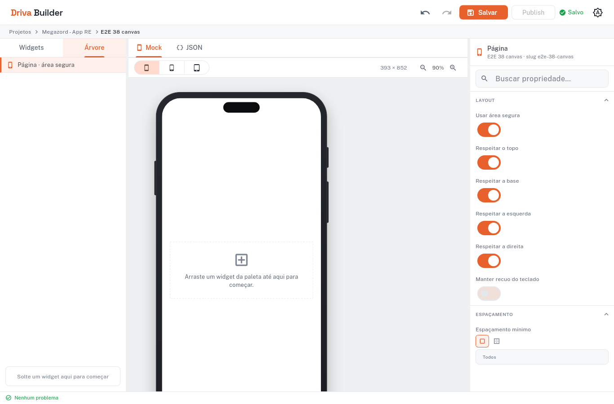

- **O script já provou:** o spec ficou sem root — e nenhum diálogo apareceu (D9)
- **Só o seu olho prova:** a página volta ao estado vazio, com o convite da paleta

### Ctrl+Z devolve

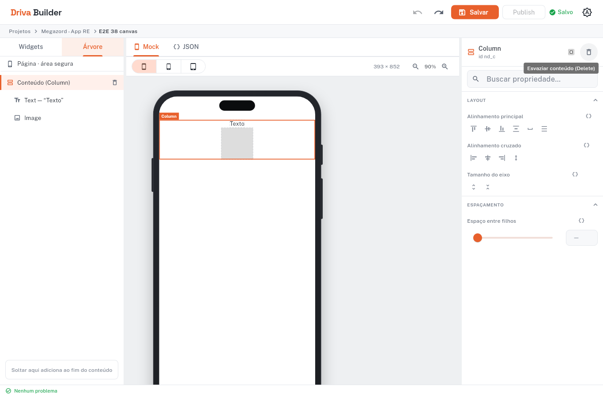

- **O script já provou:** o conteúdo voltou inteiro
- **Só o seu olho prova:** nada se perdeu: os dois filhos voltam na mesma ordem

### Reabre após reload

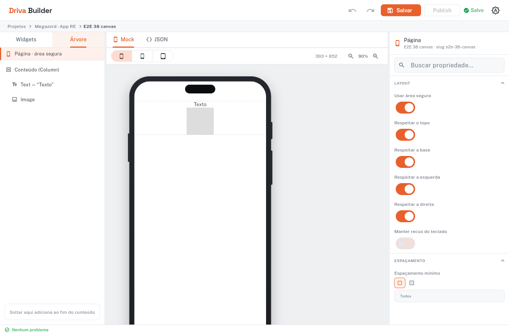

- **O script já provou:** o conteúdo reabriu com a árvore montada (3 linhas) e o spec idêntico ao de antes do reload
- **Só o seu olho prova:** nada de tela de erro nem de conteúdo inválido: o canvas volta a desenhar e a árvore mostra Conteúdo (Column) › Text, Image

### Reordenar dentro da column

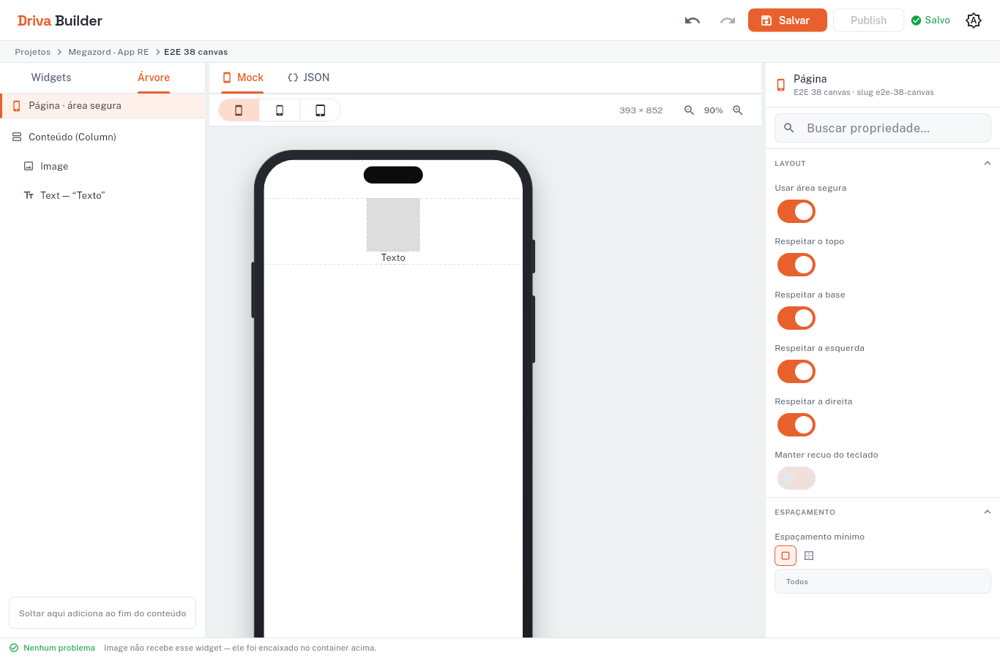

- **O script já provou:** a ordem virou column[image,text]
- **Só o seu olho prova:** o arraste dentro da árvore se comporta como numa Column montada à mão
