# Rodada 01 — E2E do item 39 (URL da imagem e props)

> Prints **gerados pelo QA** (headless, via CDP, contra a homologação real). O dev
> humano **confere** — não opera o browser. Cada estado foi produzido na tela do
> editor e **conferido por rede** (domínio `Network` do CDP) e **por spec** (API).

**Resultado das asserções:** 26 PASS / 3 FAIL

**Falhas:** (D15/DoD 23) o campo mostra "Ajustado para o mínimo (1)" | (D15/DoD 23) o campo mostra errorText de valor inválido | (D15/DoD 23) os dois sinais se distinguem

**Comece pelo primeiro print.** Ele é a cancela do item (DoD 24): quatro estados
lado a lado, mesmo tamanho, mesmo recorte. Se dois forem iguais, pare por aí.

## Como regerar

```bash
docs/16-image-url-e-props/e2e_hml.sh            # contrato por API (idempotente)
docs/16-image-url-e-props/e2e_shots.sh 01       # estes prints, na rodada 01
```

Os dois criam um único conteúdo de teste no projeto `default` do hml e o apagam
no fim. Nada sobra em homologação; nada disso vai para produção.

## O que o script NÃO consegue provar (é o seu roteiro)

Está em [`roteiro_e2e_humano.md`](../../roteiro_e2e_humano.md) — a peça que máquina
nenhuma pega aqui é o **`driva_demo_app` no celular** (DoD 26): imagem carregando
**direto do host**, sem passar pelo proxy.

## Estados capturados

### DoD 24 — OS QUATRO ESTADOS LADO A LADO (a cancela da feature)

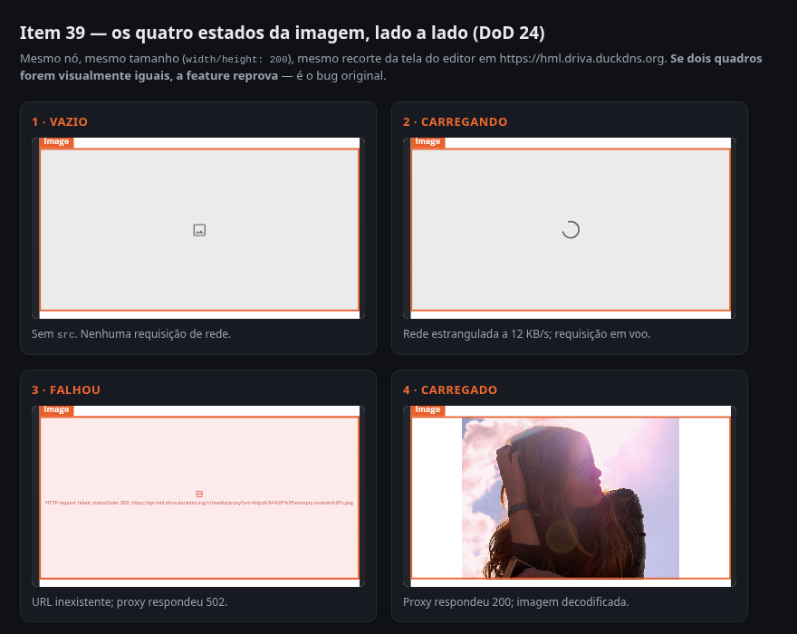

- **O script já provou:** os quatro recortes têm geometria idêntica e são diferentes entre si nos seis pares (comparação byte a byte dos PNGs) — nenhum estado é o mesmo pixel de outro
- **Só o seu olho prova:** **decida em segundos:** os quatro quadros contam quatro histórias diferentes para quem não leu o código? Se dois se parecerem, o item 39 reprova

### Estado VAZIO — sem URL


- **O script já provou:** com `src` ausente o editor não dispara requisição nenhuma de imagem (0 chamadas ao proxy) — o estado é "falta preencher", não "deu erro"
- **Só o seu olho prova:** a caixa é neutra (ícone de imagem, cinza) e se lê como "falta a URL" — nada de vermelho, nada de texto de erro

### helpText nos DOIS caminhos de moldura (D8)

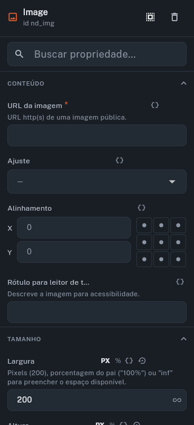

- **O script já provou:** o Inspector do `image` renderiza o `helpText` do `src` (moldura do PropFieldEditor) e o da `Largura` (moldura própria do DimensionEditor) — os dois caminhos da D8, num print só
- **Só o seu olho prova:** os textos de ajuda estão legíveis e abaixo do rótulo, sem cortar

### Estado CARREGANDO — com throttling de rede

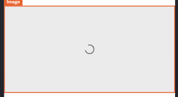

- **O script já provou:** com a rede estrangulada (12 KB/s, cache desligado) a requisição ao proxy está EM VOO no instante da captura — o `frameBuilder` desenha o estado enquanto `frame == null` (D12)
- **Só o seu olho prova:** o indicador de progresso aparece na caixa, e ela é visivelmente diferente da caixa vazia e da de erro

### Estado CARREGADO — caso A (host com ACAO)

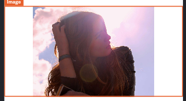

- **O script já provou:** o proxy devolveu 200 para https://picsum.photos/1600/1200 e a imagem foi decodificada
- **Só o seu olho prova:** a foto aparece inteira dentro da caixa — é uma imagem, não um retângulo colorido

### Estado FALHOU — URL inexistente

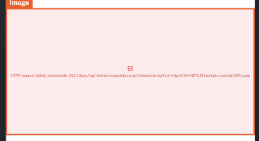

- **O script já provou:** o proxy devolveu 502 para https://exemplo.invalido/x.png; o renderer desenhou a caixa de erro com o motivo em texto (não o quadrado cinza mudo de antes)
- **Só o seu olho prova:** o motivo está LEGÍVEL na caixa e ela é claramente diferente da caixa vazia. O texto cita `…/v1/media/proxy?url=…` — **esperado**: é a URL que a NetworkImageLoadException tentou buscar, e só aparece no editor (showDiagnostics)

### Tooltip do erro — o motivo E a URL original

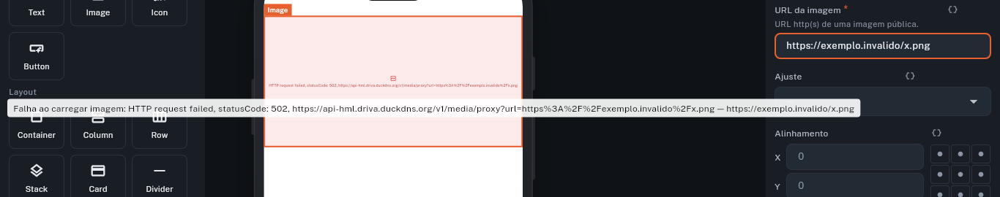

- **O script já provou:** com o mouse parado sobre a caixa de erro o Tooltip aparece (é o `Tooltip` do ImageErrorBox, invisível para a árvore acessível — só existe no pixel)
- **Só o seu olho prova:** o balão traz o motivo E a URL que VOCÊ digitou, no fim da mensagem — é assim que se descobre um erro de digitação sem abrir o JSON

### Caso B — URL sem ACAO carregando (o relato do dev)


- **O script já provou:** a URL do relato (host sem Access-Control-Allow-Origin) foi buscada pelo proxy e respondeu 200; é o que a F3 entrega
- **Só o seu olho prova:** o logo aparece de verdade dentro da caixa — antes do item 39 esta caixa ficava cinza e muda

### Largura = 0

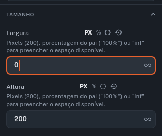

- **O script já provou:** o valor comitado no spec é 1 (o clamp da D6 agiu)
- **Só o seu olho prova:** **a mensagem "Ajustado para o mínimo (1)" que a D15 exige NÃO aparece** — o campo mostra 0 e o spec grava 1, sem sinal nenhum. Compare com o print seguinte

### Largura = abc

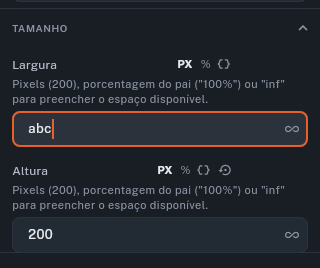

- **O script já provou:** o texto inválido não derruba o editor
- **Só o seu olho prova:** **o `errorText` que a D15 exige NÃO aparece** — e o print anterior (0) é IGUAL a este: os dois sinais não se distinguem porque nenhum dos dois existe

### width "100%" + raio + cor de fundo + alinhamento

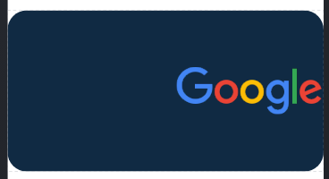

- **O script já provou:** o spec com `width: "100%"`, `borderRadius: 24`, `backgroundColor` e `alignment: centerRight` foi aceito e desenhado; a imagem veio pelo proxy (200)
- **Só o seu olho prova:** quatro coisas num print só: a caixa ocupa a LARGURA TODA do mock (o "100%"), os CANTOS estão ARREDONDADOS **e o arredondamento corta a imagem** (o raio compõe — sem platform view no caminho, que era o risco da D2), o FUNDO ESCURO aparece atrás do PNG transparente, e o logo está ENCOSTADO À DIREITA (o alignment)

### Compatibilidade — `width: 240` numérico (spec pré-F4)


- **O script já provou:** um spec no formato antigo (número cru, sem unidade) continua válido e renderiza — a migração doubleNum→dimension da D3 não quebrou conteúdo existente
- **Só o seu olho prova:** a imagem aparece com 240px de largura, sem caixa de erro e sem aviso de spec inválido

### Reabre após recarregar o navegador

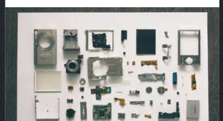

- **O script já provou:** depois de um reload completo o spec é byte a byte o mesmo e a imagem volta a desenhar
- **Só o seu olho prova:** nada de tela de erro nem de conteúdo inválido — o canvas volta a mostrar a imagem

### DoD 13b/19 — a rede provando que foi pelo proxy, contra o backend real

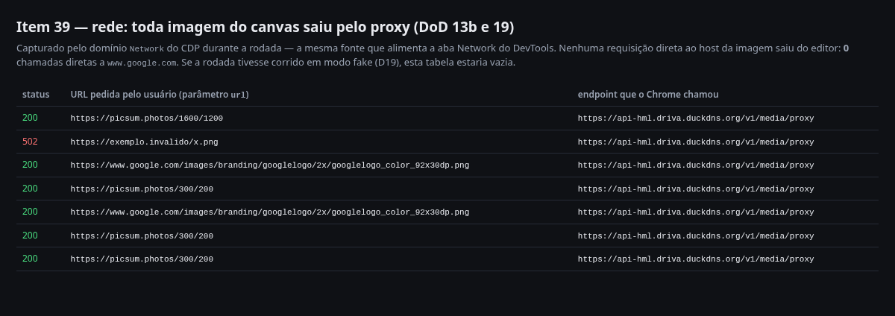

- **O script já provou:** 7 requisições de imagem, todas para `https://api-hml.driva.duckdns.org/v1/media/proxy`, e zero chamadas diretas ao host — a rodada não correu em modo fake
- **Só o seu olho prova:** confira que a coluna do meio traz as URLs que você reconhece (picsum, google) e que o endpoint é sempre o do backend de homologação
