# Rodada 01 — E2E do item 24 (publicação e versionamento)

> Prints **gerados pelo QA** (headless, via CDP, contra a homologação real). O dev
> humano **confere** — não opera o browser. Cada passo foi executado na tela e o
> estado resultante foi conferido por API.

**Resultado das asserções:** 35 PASS / 0 FAIL

## Como regerar

```bash
docs/24-publicacao-versionamento/e2e_hml.sh          # contrato por API (idempotente)
docs/24-publicacao-versionamento/e2e_shots.sh 01     # estes prints, na rodada 01
```

Os dois criam um único conteúdo de teste (slug `e2e-24-publicacao`) no projeto
`default` do hml e o apagam no fim. Nada sobra em homologação; nada disso vai
para produção.

## Os dois modos de falha (item do DoD)

O item 24 nasceu com duas falhas silenciosas, corrigidas antes deste E2E. O
roteiro **provoca as duas de verdade** (cortando a rota por CDP) para que o
print prove que falhar é visualmente diferente de dar certo:

| Caminho | Sucesso | Falha |
| --- | --- | --- |
| Publicar | `04_topo_no_ar_v1.png`, `07_topo_no_ar_v2.png`, `12_republicado_v3.png` | `13_publish_falhou.png` |
| Restaurar | `11_restaurado_no_canvas.png` | `14_restore_falhou_dialogo_aberto.png`, `15_restore_falhou_barra.png` |

## O que o script NÃO consegue provar (é o seu olho)

O topo do shell e o rodapé do editor **não expõem árvore semântica** (achado A1
do `test_plan.md`): o script prova que a faixa da tela **mudou** ou **não
mudou**, nunca o texto que está escrito nela. Ler "No ar (v3)", "Alterações não
publicadas" e "Falha ao publicar. Tente novamente." nos prints é a parte que
sobra para você.

## Estados capturados

### Lista: selo "Rascunho"

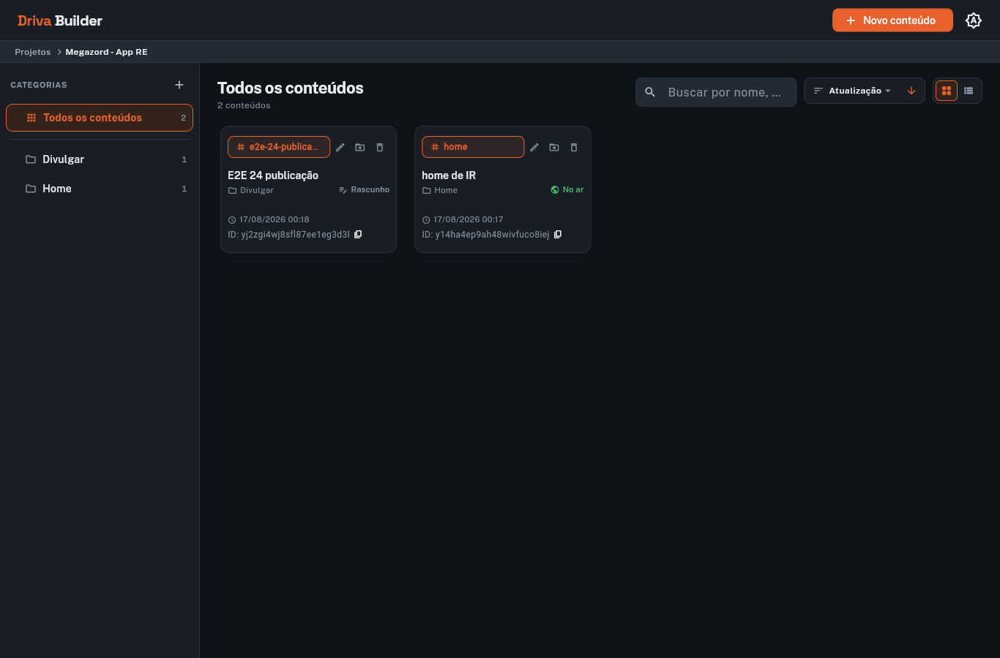

- **O script já provou:** o card do conteúdo de teste expõe `Rascunho: Nunca publicado` na árvore semântica
- **Só o seu olho prova:** o selo é discreto, ao lado da categoria, e legível — ícone + texto

### Editor: "Nunca publicado"

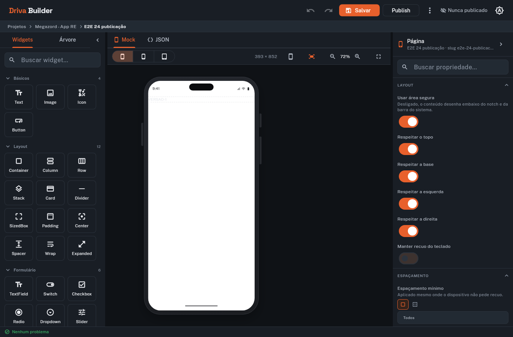

- **O script já provou:** o editor abriu no conteúdo de teste, que a API reporta como publishedVersion == null
- **Só o seu olho prova:** o topo diz "Nunca publicado" com o ícone de olho fechado, e o botão Publish está clicável (contorno, não apagado)

### Diálogo de publicação

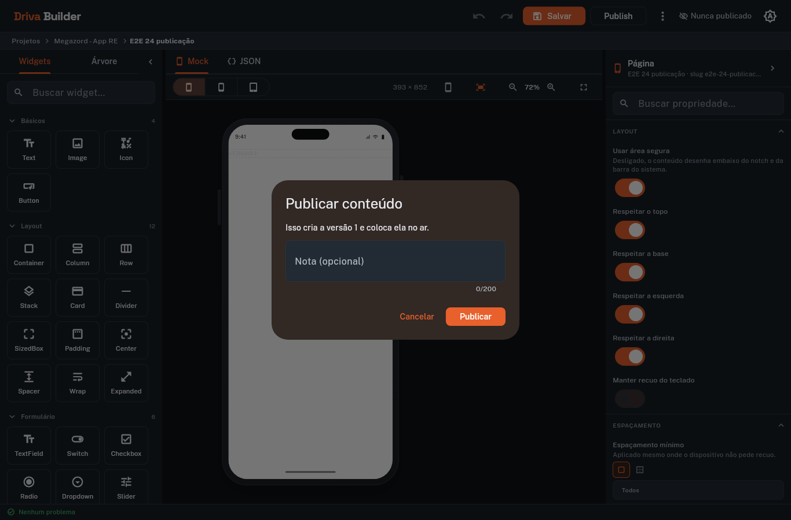

- **O script já provou:** o diálogo diz "Isso cria a versão 1 e coloca ela no ar"
- **Só o seu olho prova:** o campo de nota mostra o contador de 200 caracteres e o botão "Publicar" está em destaque

### Publicado: "No ar (v1)"

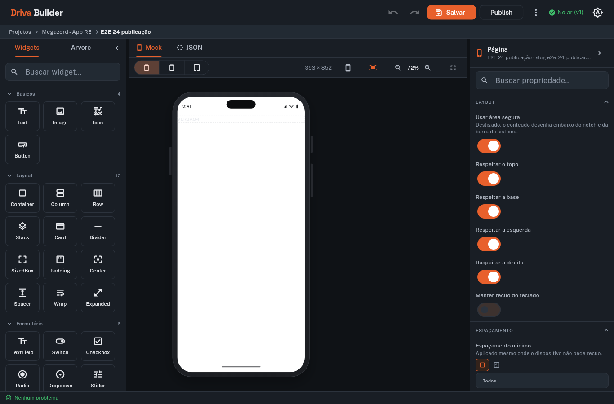

- **O script já provou:** a API devolve publishedVersion.version == 1, a nota foi gravada e a faixa do indicador do topo mudou de imagem
- **Só o seu olho prova:** o topo agora diz "No ar (v1)" em verde COM ícone de check — compare com o print 13 (falha), que é o mesmo lugar da tela em outro estado

### Lista: selo "No ar"


- **O script já provou:** o mesmo card agora expõe `No ar: …` — o dado vem do summary da própria lista, sem request extra
- **Só o seu olho prova:** o selo mudou de ícone e de cor, e o tooltip conta a nuance

### Editor: alterações não publicadas


- **O script já provou:** com o rascunho mais novo que o publicado, a faixa do indicador é diferente das duas anteriores
- **Só o seu olho prova:** o topo diz "Alterações não publicadas" — o terceiro estado, distinguível por ícone, não só pela frase

### Publicado: "No ar (v2)"


- **O script já provou:** a API tem duas versões e o indicador do topo mudou de imagem outra vez
- **Só o seu olho prova:** o topo diz "No ar (v2)" — o número acompanhou a versão, não ficou preso na v1

### Menu "Mais opções"

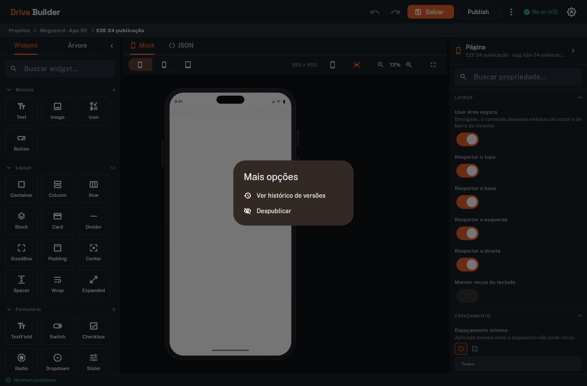

- **O script já provou:** o menu expõe "Ver histórico de versões" e "Despublicar"
- **Só o seu olho prova:** despublicar está escondido atrás do menu, nunca no botão principal (decisão do §8 do plano)

### Histórico de versões

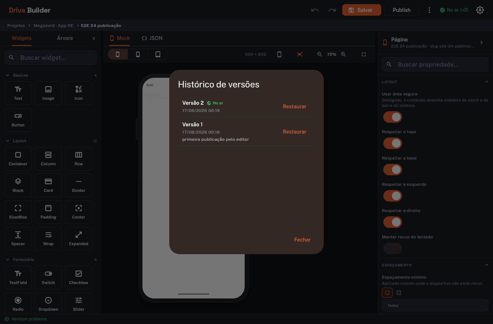

- **O script já provou:** o diálogo lista "Versão 2" e "Versão 1", com a nota da primeira publicação
- **Só o seu olho prova:** a v2 (a mais nova) está no topo e é a única com o selo "No ar"; cada linha tem data e o botão Restaurar

### Confirmação de restauro

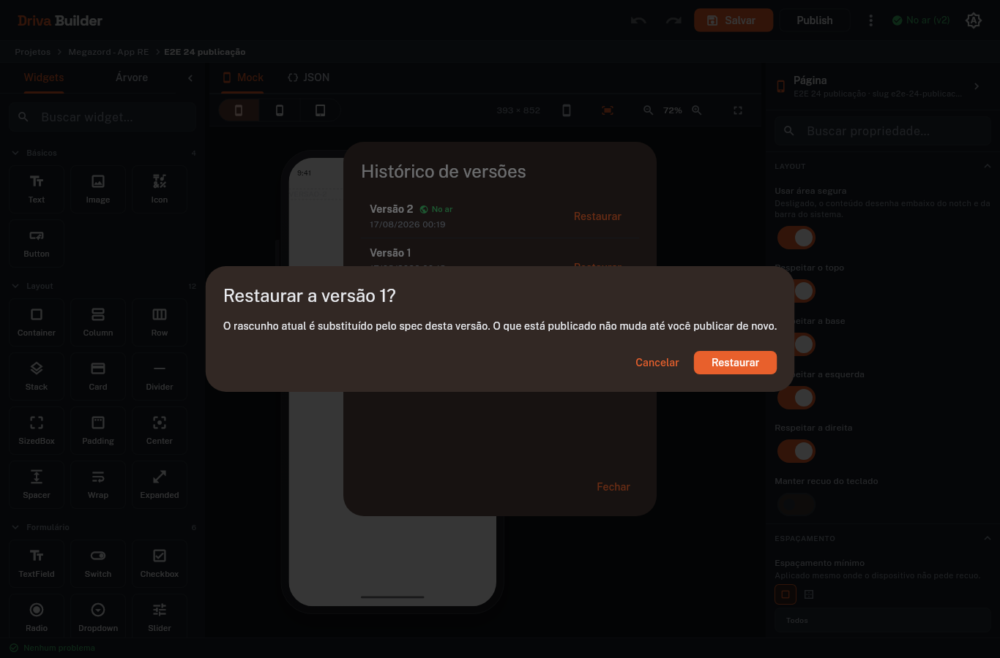

- **O script já provou:** o diálogo diz "Restaurar a versão 1?" e avisa que o publicado não muda
- **Só o seu olho prova:** a confirmação é uma etapa separada de fechar o histórico — não dá para restaurar por engano

### Restaurado para o rascunho

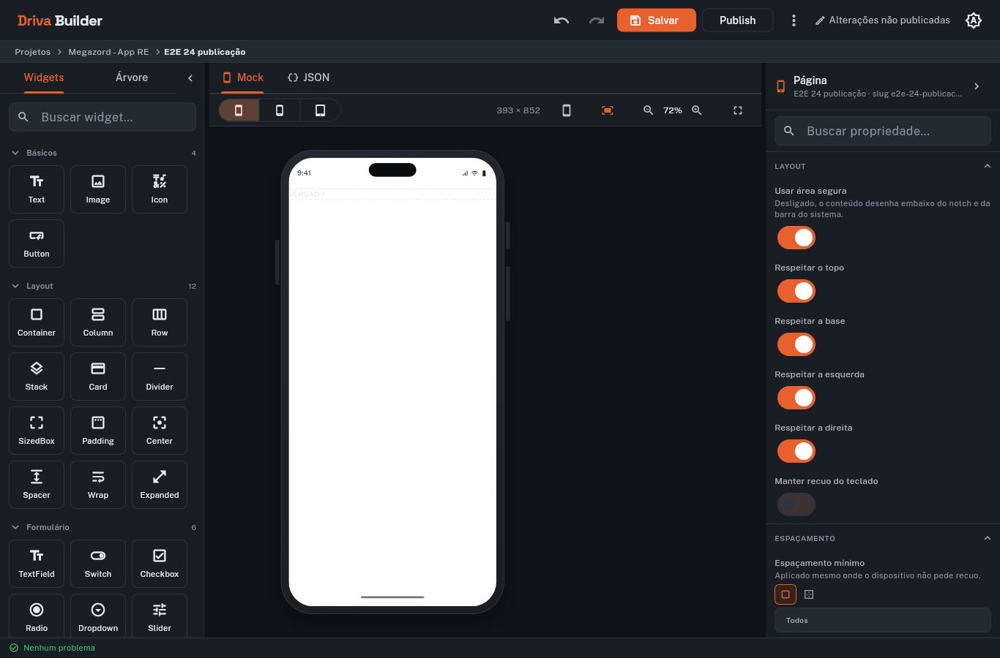

- **O script já provou:** o diálogo fechou, o rascunho do servidor voltou a ser o spec da v1 e publishedVersion continua 2
- **Só o seu olho prova:** o canvas passou a desenhar o conteúdo da v1, o rodapé NÃO tem aviso de erro e o botão Desfazer ficou habilitado

### Rollback publicado como v3

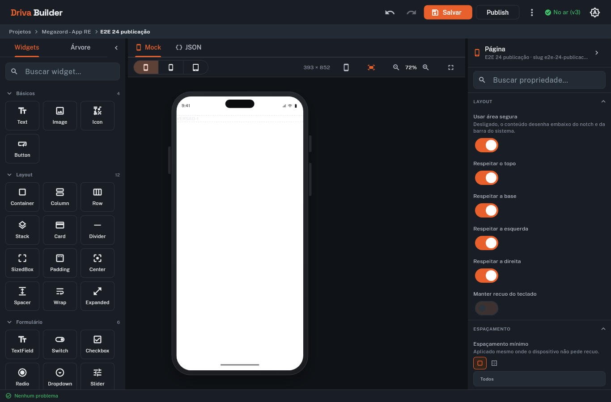

- **O script já provou:** publicar com o rascunho sujo salvou antes: a v3 carrega o spec da v1 (rollback em duas etapas, D4)
- **Só o seu olho prova:** o topo diz "No ar (v3)" e o rodapé continua sem aviso de erro

### FALHA de publicação (modo de falha 1)

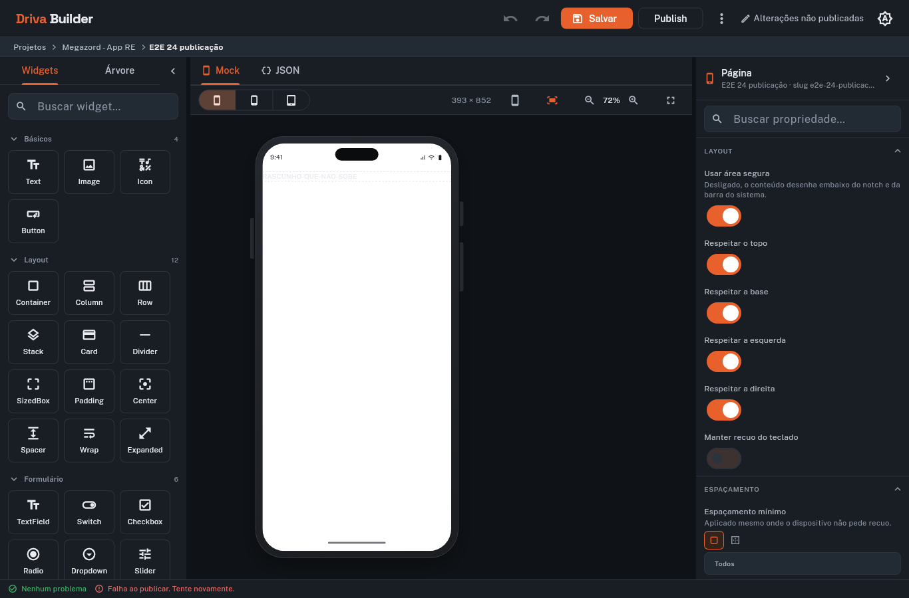

- **O script já provou:** com a rota /publish cortada, a faixa do rodapé mudou (o aviso apareceu), a faixa do topo NÃO mudou (continua "Alterações não publicadas") e nenhuma versão nasceu
- **Só o seu olho prova:** o rodapé traz "Falha ao publicar. Tente novamente." com ÍCONE de erro em vermelho — inconfundível com os prints 04/07/12, onde o topo fica verde e o rodapé fica limpo

### FALHA de restauro (modo de falha 2)

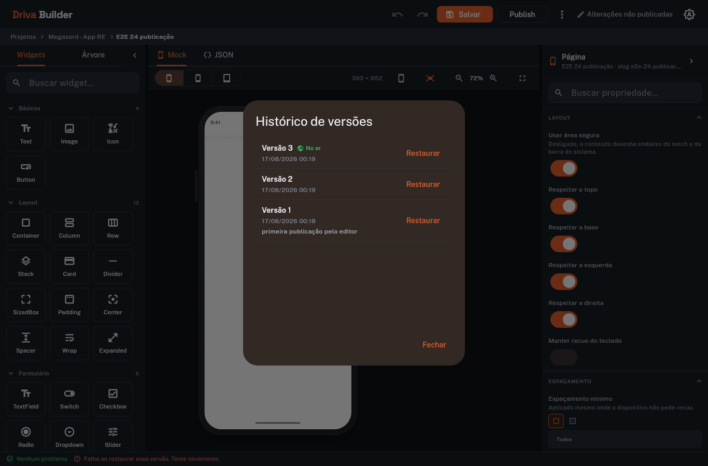

- **O script já provou:** com a rota /restore cortada, o diálogo de histórico NÃO fecha e o rascunho do servidor continua intacto — compare com o passo 10, onde o sucesso fecha o diálogo
- **Só o seu olho prova:** o diálogo segue aberto sobre a tela e o aviso de erro aparece atrás dele, no rodapé

### FALHA de restauro no rodapé

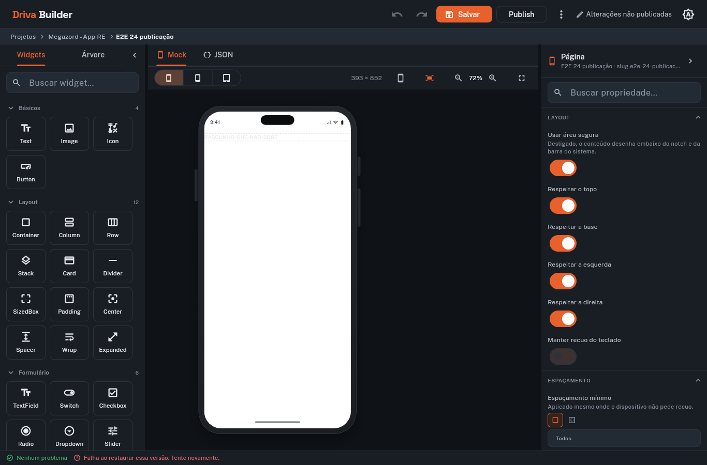

- **O script já provou:** fechado o diálogo, a faixa do rodapé continua diferente da que o restauro bem-sucedido deixou
- **Só o seu olho prova:** o rodapé traz "Falha ao restaurar essa versão. Tente novamente." com ícone de erro; no print 11 (sucesso) não há aviso nenhum

### Confirmação de despublicar

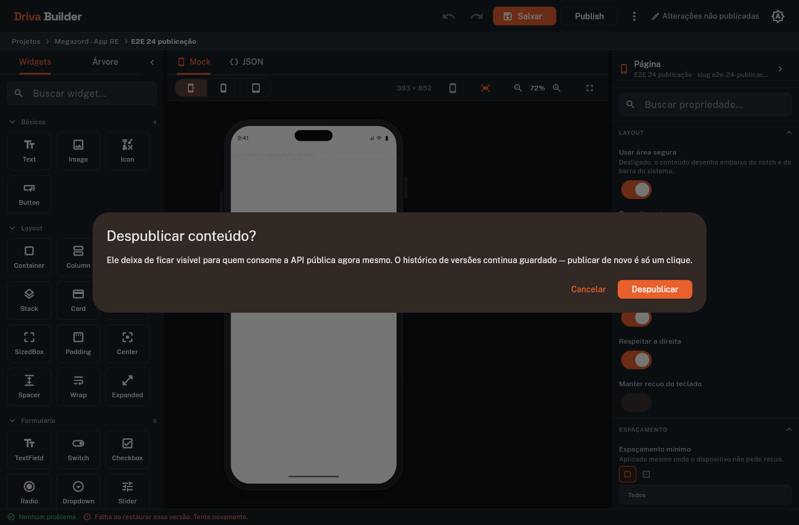

- **O script já provou:** o diálogo avisa que o conteúdo some da API pública agora e que o histórico fica guardado
- **Só o seu olho prova:** a confirmação deixa claro que a ação é reversível — não assusta mais do que precisa

### Despublicado


- **O script já provou:** publishedVersion virou null, as 3 versões continuam na API e o indicador do topo mudou de imagem
- **Só o seu olho prova:** o topo volta a "Nunca publicado"; nada no editor sugere que o histórico foi perdido

### Lista: de volta a "Rascunho"


- **O script já provou:** despublicar refletiu na lista de conteúdos, pelo mesmo summary
- **Só o seu olho prova:** o card fecha o ciclo no mesmo estado visual do print 01
