# Rodada 02 — item 46 (projectId na rota do editor)

> Prints **gerados pelo QA** (headless, via CDP, contra a **homologação real**).
> O dev humano **confere** — não opera o browser. Cada passo foi executado na
> tela do hml e o resultado conferido por CDP (URL, árvore semântica, headers no
> fio) e por API.

**Data:** 2026-08-17.
**Resultado das asserções:** 35 PASS / 0 FAIL / 0 bloqueado(s)

## Ambiente

| Item | Valor |
| --- | --- |
| Editor | `https://hml.driva.duckdns.org` — **homologação servida pelo Coolify** (§11.3›22; nunca `localhost`, lição do item 9g) |
| API | `https://api-hml.driva.duckdns.org/v1` (real) |
| `USE_FAKE_DATA` | `false` — provado pelas 2 chamadas HTTP reais capturadas no fio e listadas em `03b_network.txt` (§11.3›23) |
| `PROJ_A` | Portal da RE · `qyk9xbclx0moxwno3wplb4u9` — **≠ `default`** (§11.3›24) |
| `CT_A` | E2E 46 — conteúdo A · `p5ha2j9x7dgjkaqla0gy2wyt` |
| `PROJ_B` | E2E item 46 — projeto B · `o8zw3ctaahlni0lhyqpes8f6` |
| `CT_B` | E2E 46 — conteúdo B · `b7pxnjxd94qb53c7c60vtp27` |
| `ID_FANTASMA` | `nao-existe-46` |
| Janela | 1600×1000, Chrome headless novo, `--user-data-dir` temporário |

> **A faixa escura no rodapé de cada print é do driver, não do navegador.**
> Headless não tem barra de endereços, e a §10 pede a URL legível. A faixa é
> injetada no DOM logo antes da captura, lê `location.href` da própria página e
> some em seguida. A linha verde, quando existe, traz um valor que o driver
> capturou do app (o link do preview, o header da requisição).

## Resultado por passo

| # | Passo (§10) | Resultado | Print | Prova qual linha do DoD |
| --- | --- | --- | --- | --- |
| 1 | Home → `PROJ_A` → abrir `CT_A` pelo caminho normal | URL `/projects/qyk9xbclx0moxwno3wplb4u9/contents/p5ha2j9x7dgjkaqla0gy2wyt/edit` | `01_url_com_dois_ids.png` | §11.3›22, §11.3›24 |
| 2 | **F5** na mesma aba | mesmo conteúdo, mesmo projeto | `02_reload_mesmo_conteudo.png` | §11.4›**29** — o defeito de origem |
| 3 | URL colada em aba anônima | abriu direto, sem passar pela tela do projeto | `03_aba_anonima.png` | §11.4›30 |
| 3b | Header da **primeira** requisição | `x-project-id: qyk9xbclx0moxwno3wplb4u9` | `03b_header_primeira_requisicao.png` + `03b_network.txt` | §11.3›23, §11.4›30 (D2) |
| 4 | "Ver no celular" — a URL do link gerado | `https://hml.driva.duckdns.org/preview/qyk9xbclx0moxwno3wplb4u9/p5ha2j9x7dgjkaqla0gy2wyt` (lido via árvore semântica do diálogo) | `04_link_preview_projeto_certo.png` | §11.4›**31** — **o aceite que carrega o item** |
| 4b | Abrir o link no aparelho | **do humano** — instruções abaixo | `04b_preview_no_aparelho.jpg` (a tirar) | §11.4›31 |
| 5 | Breadcrumb → projeto | levou a `/projects/qyk9xbclx0moxwno3wplb4u9` | `05_breadcrumb_e_volta.png` | §11.4›32 |
| 6 | `:projectId` trocado por `PROJ_B` (válido) | mensagem nomeando "E2E item 46 — projeto B" | `06_falha_conteudo_fora_do_projeto.png` | §11.4›33, §11.4›36 (D7) |
| 7 | `:projectId` inexistente | mensagem e ação **diferentes** das do passo 6 | `07_falha_projeto_inexistente.png` | §11.4›34, §11.4›35 (D8) |
| 8 | Link no formato antigo | caiu na home, sem aviso dedicado | `08_link_antigo_home.png` | §11.4›37 (D4) |
| 9 | `CT_A` → `CT_B` → voltar pelo histórico | os três carregam certo | `09a_ct_a.png`, `09b_ct_b.png`, `09c_volta_ct_a.png` | §11.4›38 |

> **A ordem de execução não é a ordem da numeração**, e isso é de propósito: a
> §10 manda abrir o "ver no celular" (passo 4) e conferir o breadcrumb (passo 5)
> **na aba já recarregada do passo 2**. O passo 3 é o último a rodar na sessão
> principal porque exige um contexto anônimo novo. A numeração dos prints segue a
> §10; o `resultado.txt` segue a execução.

## O que destravou desde a `rodada_01`

A rodada 01 registrou o **passo 4 como bloqueado**: o diálogo "Ver no celular"
abria, mas o conteúdo não pintava e a árvore semântica colapsava sob a barreira
de rota modal. Aqui ele **passa por leitura direta** — a mesma árvore semântica
que lá vinha vazia entrega o nó com a URL inteira, e o print mostra o diálogo
desenhado (QR, link e as duas ações).

A diferença não está no app: a rodada 01 dirigia um **build de debug em
`localhost`** (o merge estava travado), e esta dirige o **artefato de release
servido pelo Coolify**. É a mesma lição já registrada sobre o "tofu" do
`flutter run` — o que o Chromium mostra num build de debug não é evidência de
defeito. O que continua valendo do achado do item 45: o **topo do shell e a
barra de breadcrumb** seguem sem semântica nenhuma, e por isso o passo 5 clica o
crumb por varredura verificada, não por rótulo.

## O que o passo 4b espera de você (§11.4›31)

Abra **esta URL exata** num celular de verdade (não no simulador do navegador):

```
https://hml.driva.duckdns.org/preview/qyk9xbclx0moxwno3wplb4u9/p5ha2j9x7dgjkaqla0gy2wyt
```

O conteúdo tem de aparecer — a vista de preview mostra **"Canvas do conteúdo A (item 46)"** — e não um
404. Salve a foto como `04b_preview_no_aparelho.jpg` nesta pasta. As fixtures
deste E2E **ficam de pé** em homologação justamente para você poder fazer isso
depois que o script terminar.

## Os três modos de falha (§11.4›35)

Os passos 6, 7 e 8 produzem telas visualmente distintas entre si e da tela
carregada — por **texto, ação e ícone**:

| Passo | Mensagem | Ação | Ícone |
| --- | --- | --- | --- |
| 6 | Não encontramos este conteúdo no projeto "E2E item 46 — projeto B". | Voltar para o projeto | lupa riscada (`search_off`) |
| 7 | Este link aponta para um projeto que não existe. | Ver meus projetos | pasta riscada (`folder_off_outlined`) |
| 8 | (nenhuma — a home de projetos) | — | — |

**Nada aqui depende de cor:** no código, os passos 6 e 7 usam o **mesmo** tom
(`_FailureTone.danger`) — a diferença que você vê no print é necessariamente de
texto e de glifo, nunca de matiz.

## Como regerar

```bash
docs/46-projectid-na-rota-do-editor/e2e_shots.sh 02
```

Idempotente: o script **resolve** as fixtures (projeto por id, conteúdo por slug,
categoria existente escolhida na criação — R2d) em vez de recriá-las, e carimba
o mesmo spec marcador nos dois conteúdos. Auto-limpante quanto ao rastro do
driver (Chrome headless, perfil temporário, contexto anônimo, abas de preview,
faixa injetada no DOM). **Nada disso vai para produção; nenhuma linha de
código-fonte foi tocada.**

## Estados capturados

### Passo 1 — a URL do editor carrega os dois ids


- **O script já provou:** a URL da aba é exatamente https://hml.driva.duckdns.org/projects/qyk9xbclx0moxwno3wplb4u9/contents/p5ha2j9x7dgjkaqla0gy2wyt/edit e o marcador "Canvas do conteúdo A (item 46)" apareceu na tela
- **Só o seu olho prova:** o breadcrumb diz Projetos › Portal da RE › E2E 46 — conteúdo A — o nome do projeto legível, e não "default"

### Passo 2 — F5 recarrega o mesmo conteúdo, no projeto certo

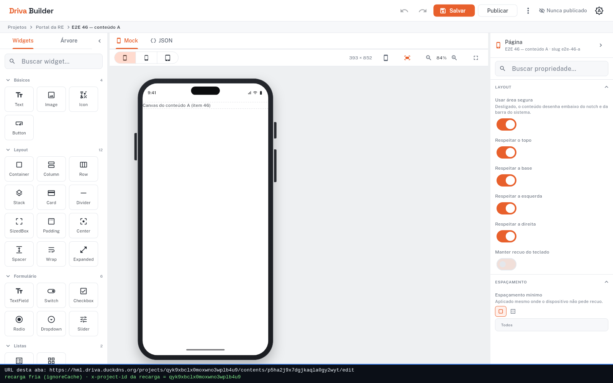

- **O script já provou:** a URL não mudou, o marcador do CT_A voltou e nenhuma tela de falha apareceu
- **Só o seu olho prova:** o breadcrumb continua "Portal da RE" — este é o print do §11.4›29: qualquer outro nome aqui reprova

### Passo 4 — a URL que o "ver no celular" gera

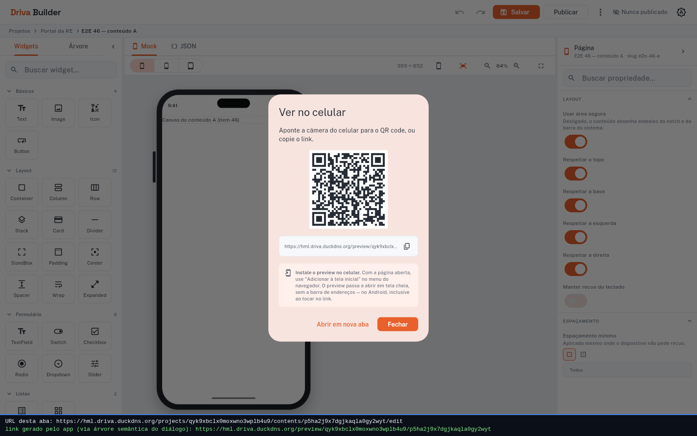

- **O script já provou:** o app gerou https://hml.driva.duckdns.org/preview/qyk9xbclx0moxwno3wplb4u9/p5ha2j9x7dgjkaqla0gy2wyt
- **Só o seu olho prova:** a URL dentro do diálogo aparece truncada pela largura da caixa (320px) — a linha verde do rodapé traz a string INTEIRA, lida do próprio app

### Passo 5 — o breadcrumb volta para o projeto certo

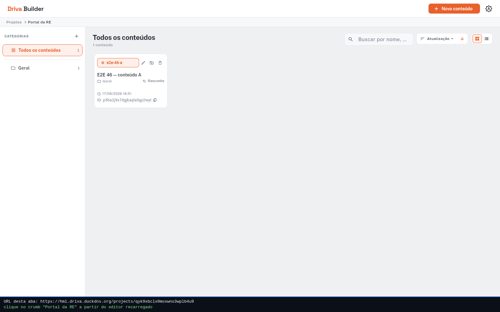

- **O script já provou:** o clique no breadcrumb levou a /projects/qyk9xbclx0moxwno3wplb4u9, e a lista aberta é a do PROJ_A (o "E2E 46 — conteúdo A" está nela)
- **Só o seu olho prova:** o breadcrumb desta tela diz "Projetos › Portal da RE" — o nome do projeto legível, e não "default" nem a home

### Passo 3 — o link colado numa aba que nunca viu o app

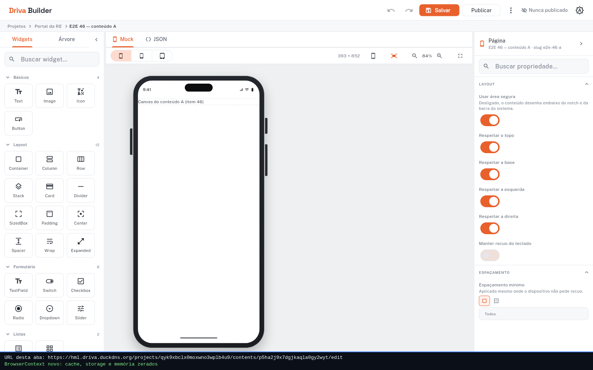

- **O script já provou:** o conteúdo abriu direto na aba anônima, com o marcador "Canvas do conteúdo A (item 46)" na tela
- **Só o seu olho prova:** o breadcrumb mostra "Portal da RE" já na primeira pintura — o escopo veio da URL, não de estado deixado para trás

### Passo 3b — a primeira requisição carrega o projeto da URL

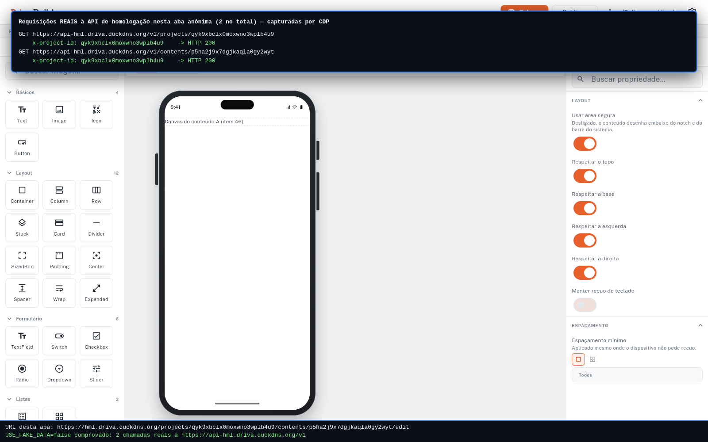

- **O script já provou:** a primeira chamada a /contents/p5ha2j9x7dgjkaqla0gy2wyt saiu com x-project-id: qyk9xbclx0moxwno3wplb4u9 — e não "default"
- **Só o seu olho prova:** o painel é desenhado pelo driver a partir do que o CDP capturou no fio; o log cru está em 03b_network.txt

### Passo 6 — conteúdo que não é daquele projeto

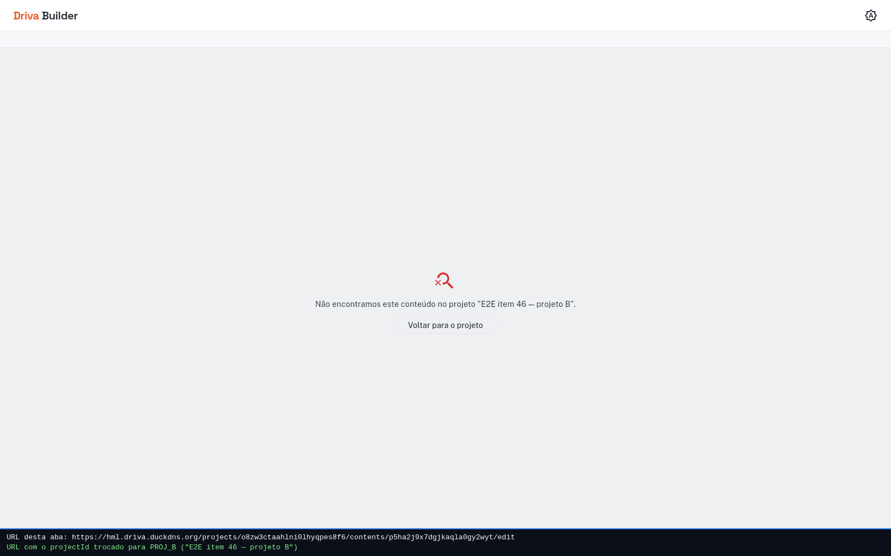

- **O script já provou:** a tela diz: Não encontramos este conteúdo no projeto "E2E item 46 — projeto B". — com a ação "Voltar para o projeto"
- **Só o seu olho prova:** ícone de LUPA RISCADA (search_off). Compare com o print 07: mesma cor (os dois usam o tom "danger" no código), texto e ícone diferentes

### Passo 7 — projeto que não existe

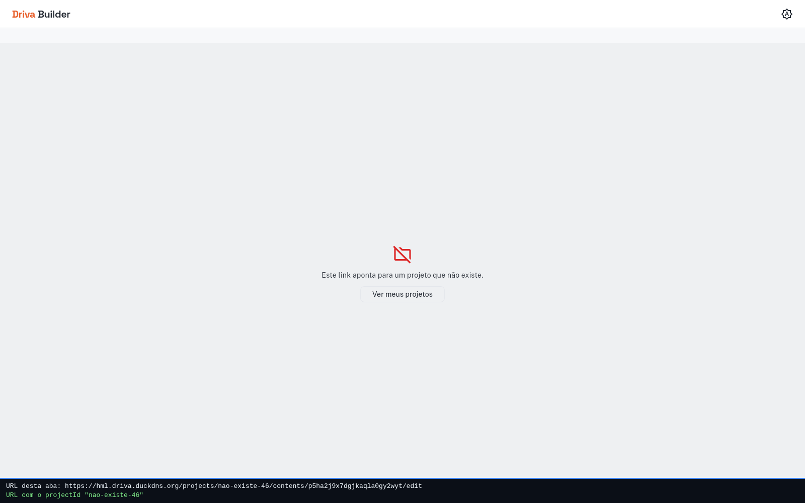

- **O script já provou:** a tela diz: Este link aponta para um projeto que não existe. — com a ação "Ver meus projetos", texto E ação diferentes dos do print 06
- **Só o seu olho prova:** ícone de PASTA RISCADA (folder_off_outlined) — o print 06 traz uma lupa riscada. Os dois usam o MESMO tom de cor no código, então a diferença que você vê não é de matiz

### Passo 8 — link no formato antigo

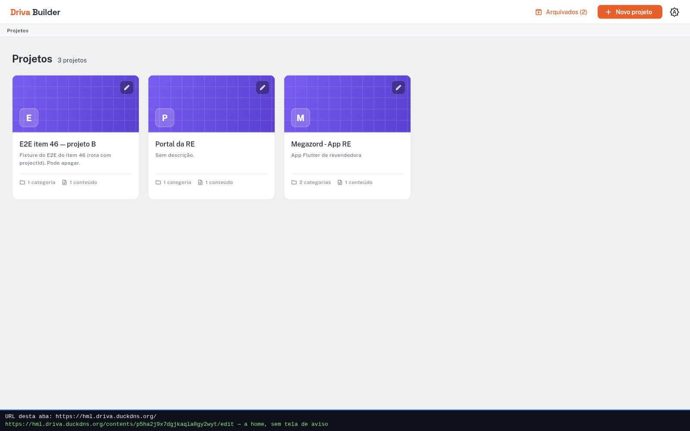

- **O script já provou:** a rota antiga não casa com nada e o router cai na home; nenhuma das mensagens de falha do editor apareceu
- **Só o seu olho prova:** a tela é a lista de projetos normal — não uma tela de erro, não uma tela em branco

### Passo 9a — CT_A no projeto A

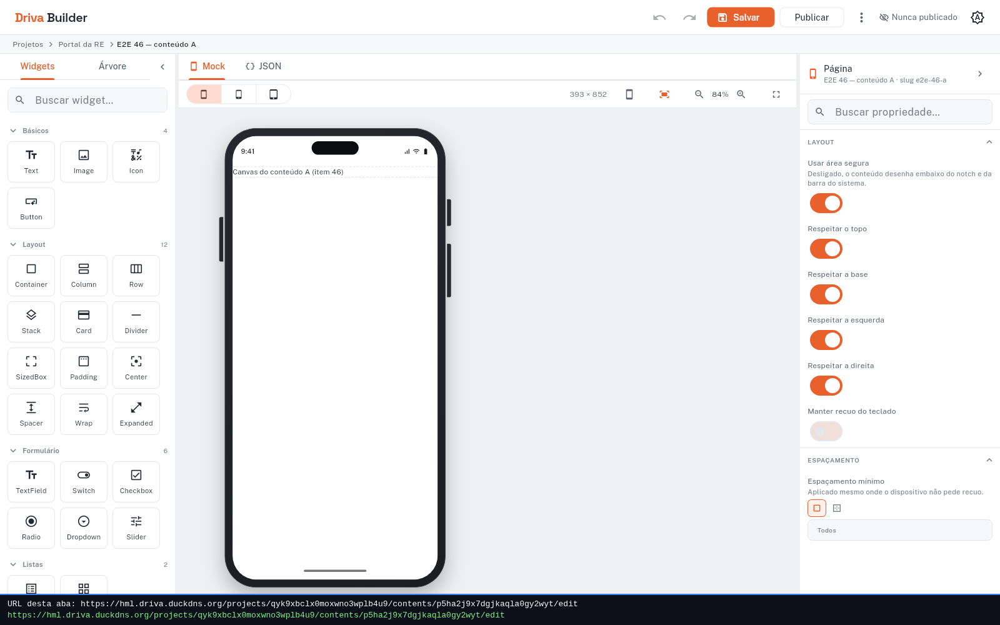

- **O script já provou:** o marcador "Canvas do conteúdo A (item 46)" apareceu
- **Só o seu olho prova:** o breadcrumb mostra "Portal da RE"

### Passo 9b — CT_B no projeto B

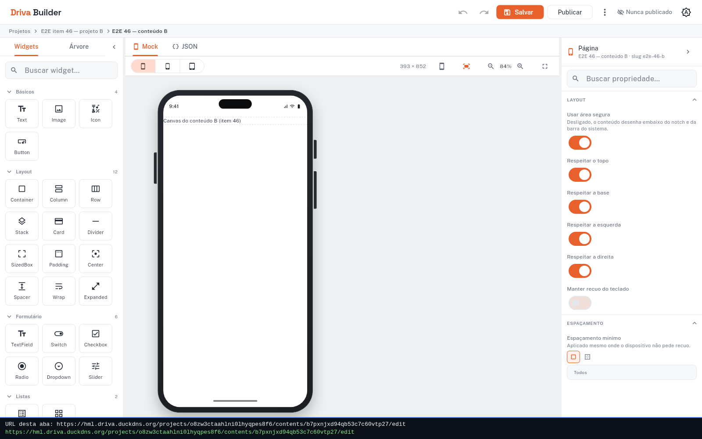

- **O script já provou:** o marcador "Canvas do conteúdo B (item 46)" apareceu — conteúdo de OUTRO projeto, na mesma aba
- **Só o seu olho prova:** o breadcrumb mudou para "E2E item 46 — projeto B"

### Passo 9c — voltar pelo histórico

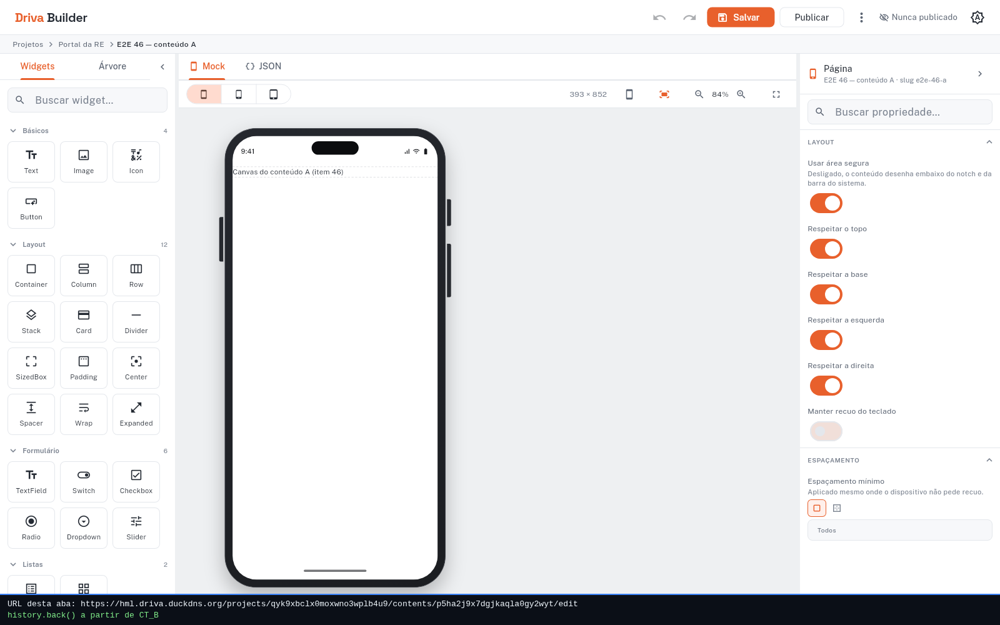

- **O script já provou:** a URL voltou a https://hml.driva.duckdns.org/projects/qyk9xbclx0moxwno3wplb4u9/contents/p5ha2j9x7dgjkaqla0gy2wyt/edit e o marcador "Canvas do conteúdo A (item 46)" voltou
- **Só o seu olho prova:** o breadcrumb voltou para "Portal da RE" — o escopo é recarimbado a cada rota, nos dois sentidos

## Auxiliar (fora da lista da §10 — ajuda a conferir o passo 4)

### Auxiliar — o link do passo 4 aberto num contexto limpo

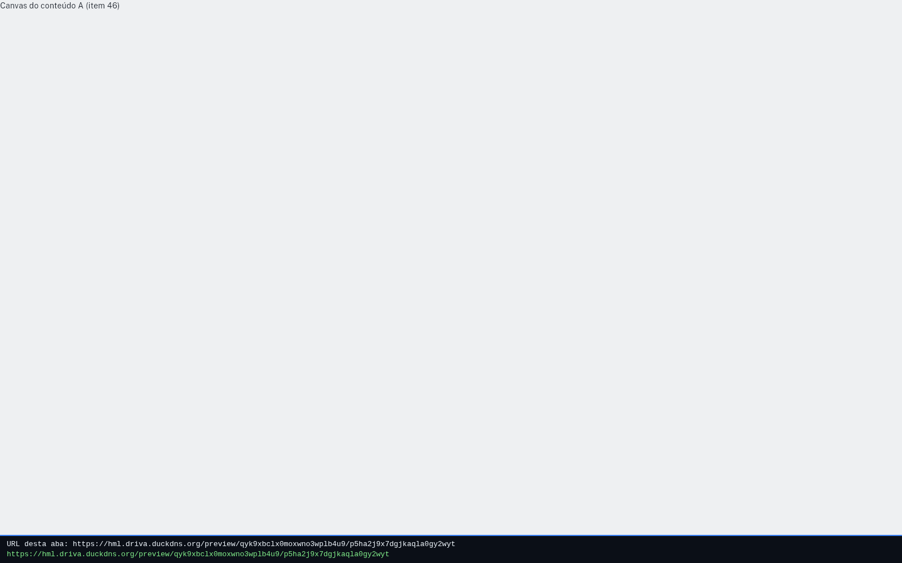

- **O script já provou:** a vista de preview desenhou "Canvas do conteúdo A (item 46)" — o link não dá 404
- **Só o seu olho prova:** não substitui o passo 4b: abrir no aparelho de verdade continua sendo do humano
