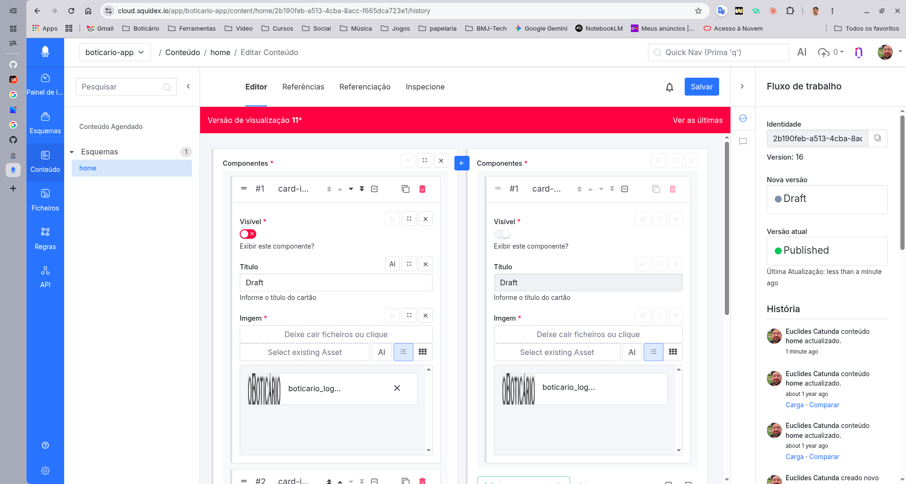

# Historico de conteudo inspirado no Squidex

> Referencia criada em 2026-08-19 a partir da captura fornecida no prompt e da documentacao/codigo publico do Squidex.

## Imagem de referencia



## O que a tela mostra

A tela de historico do Squidex combina tres coisas:

1. O editor do conteudo atual.
2. Um modo de visualizacao/comparacao de uma versao antiga.
3. Uma linha do tempo de eventos no painel lateral direito.

Na captura, o conteudo esta na versao atual `16`, mas a area central esta em modo "Versao de visualizacao 11". O banner vermelho indica que o editor nao esta vendo a ultima versao. O botao "Ver as ultimas" volta para os dados atuais. Quando o usuario clica em "Comparar" em um item do historico, a UI monta dois formularios: o conteudo atual e uma copia antiga, normalmente desabilitada, lado a lado.

No painel direito, cada item do historico mostra:

- avatar/ator;
- mensagem humana do evento;
- data relativa;
- acoes `Carregar` e `Comparar` quando o evento representa uma versao antiga carregavel.

Na captura, o Squidex traduz `Load` como `Carga`. Para uma interface em portugues, esse rotulo deve ser corrigido para `Carregar`, porque a acao carrega uma versao antiga no editor.

## Conceito central

O historico nao deve ser tratado como um campo solto dentro do conteudo. Ele e uma projecao de eventos do conteudo.

Modelo mental:

```text
Content
  id
  schemaId
  version atual
  status atual
  draft/published data

ContentSnapshot
  contentId
  version
  data
  status
  createdAt
  actor

HistoryEvent
  eventId
  ownerId/appId
  channel
  contentId
  version
  eventType
  message
  actor
  createdAt
```

No Squidex real, o sistema e event-sourced e o historico e gerado por eventos de dominio. Para recriar de forma simples, guarde um snapshot imutavel por versao. Isso evita ter que reconstruir o conteudo antigo por replay de eventos.

## Canal de historico

O Squidex consulta historico por `channel`. Para conteudo, o frontend atual monta:

```text
schemas.{schemaId}.contents.{contentId}
```

Exemplo:

```http
GET /api/apps/boticario-app/history?channel=schemas.home.contents.2b190feb-a513-4cba-8acc-f665dca723e1
```

No codigo atual do Squidex, o canal e montado a partir do `schemaId` interno e do `contentId`. Na pratica, use uma chave estavel do schema. Se seu produto usa `schema.slug` em vez de UUID interno, padronize isso desde o inicio e nao misture os dois.

Resposta esperada:

```json
[
  {
    "eventId": "evt_123",
    "eventType": "ContentUpdatedEvent",
    "actor": "subject:user-id",
    "created": "2026-08-19T12:00:00Z",
    "version": 15,
    "message": "conteudo home actualizado."
  }
]
```

## Endpoints minimos

### Listar historico

```http
GET /api/apps/{app}/history?channel={channel}
```

Comportamento:

- retorna os eventos mais recentes primeiro;
- limita por padrao aos ultimos 100 eventos;
- filtra por canal exato;
- nao retorna eventos sem mensagem humana.

### Ler conteudo atual

```http
GET /api/content/{app}/{schema}/{contentId}
```

Comportamento:

- sem cabecalho especial, retorna a versao publicada;
- com cabecalho tipo `X-Unpublished: 1`, retorna draft/rascunho quando existir;
- inclui `version`, `status`, `data`, `lastModified`, `lastModifiedBy`.

### Ler versao especifica

Preferivel:

```http
GET /api/content/{app}/{schema}/{contentId}?version={version}
```

Legado ainda encontrado em referencias:

```http
GET /api/content/{app}/{schema}/{contentId}/{version}/
```

Comportamento:

- se a versao existe, retorna o snapshot daquela versao;
- se nao existe, retorna `404`;
- a versao antiga nao vira automaticamente a versao atual.

## Regras de versao

Cada mutacao relevante incrementa a versao do conteudo.

Eventos que normalmente geram historico:

- `ContentCreated`;
- `ContentUpdated`;
- `ContentDeleted`;
- `ContentDraftCreated`;
- `ContentDraftDeleted`;
- `ContentStatusChanged`;
- `ContentStatusScheduled`;
- `ContentSchedulingCancelled`.

Regra pratica:

```text
ao executar comando de conteudo:
  validar permissao
  carregar conteudo atual
  calcular proxima versao = current.version + 1
  aplicar mutacao
  persistir conteudo atual
  persistir snapshot da nova versao
  persistir HistoryEvent com a mesma versao
```

## Draft versus publicado

O Squidex trabalha com duas representacoes:

- publicada;
- rascunho.

Enquanto nao existe rascunho, as duas podem apontar para os mesmos dados. Quando um rascunho e criado, as edicoes passam a alterar o draft e a versao publicada fica intacta.

Para recriar:

```text
Content
  id
  schemaId
  version
  status: Draft | Published | Archived
  draftData
  publishedData
  draftVersion
  publishedVersion
```

Leitura publica deve servir `publishedData`. Leitura do editor deve servir `draftData` quando houver draft.

## Fluxo da UI

Estado minimo da pagina:

```ts
type HistoryScreenState = {
  content: ContentDto;
  currentFormData: JsonObject;
  viewingVersion: number | null;
  compareFormData: JsonObject | null;
  history: HistoryEventDto[];
};
```

Ao abrir a pagina:

```text
1. GET conteudo atual com X-Unpublished: 1.
2. Renderizar formulario principal.
3. Montar channel: schemas.{schemaId}.contents.{contentId}.
4. GET historico.
5. Reconsultar historico periodicamente ou apos cada save.
```

No Squidex, o frontend reconsulta historico a cada 5 segundos enquanto o conteudo esta aberto.

### Acao "Carregar"

```text
onLoad(event):
  snapshot = GET content/{app}/{schema}/{id}?version=event.version
  currentFormData = snapshot.data
  compareFormData = null
  viewingVersion = event.version
  mostrar banner "Versao de visualizacao N"
```

Isso carrega a versao antiga no formulario principal. Se o usuario salvar, voce pode criar uma nova versao atual com esses dados. Ou seja: "carregar" e um caminho de restauracao manual, nao um rollback automatico.

### Acao "Comparar"

```text
onCompare(event):
  snapshot = GET content/{app}/{schema}/{id}?version=event.version
  currentFormData = content.data
  compareFormData = snapshot.data
  viewingVersion = event.version
  renderizar dois formularios lado a lado
  desabilitar formulario de comparacao
```

Na UI da captura, isso explica o segundo formulario acinzentado e nao editavel.

### Seta entre as versoes: copiar para o rascunho atual

Na comparacao, a versao antiga fica a direita e o formulario atual editavel fica a esquerda. A seta apontando para a esquerda aparece somente nos campos que diferem e significa:

```text
onCopyFieldFromComparedVersion(field):
  currentForm[field] = compareForm[field]
  marcar currentForm como alterado
  // nao enviar requisicao ao servidor aqui
```

Portanto, a direcao observada esta correta: o valor antigo pode passar a compor a proxima versao atual. Mas ha duas precisões importantes:

1. A acao atua no campo ou componente correspondente, e nao restaura todo o conteudo de uma vez.
2. O clique apenas altera o formulario em memoria. Uma nova entrada no historico so e criada quando o usuario salva o conteudo; esse save gera uma nova versao e um evento `ContentUpdatedEvent`.

Para recriar a experiencia, deixe o formulario da direita bloqueado e disponibilize o botao de copia apenas se `currentValue != comparedValue` e o usuario puder editar o conteudo. A versao anterior permanece preservada no historico.

### Acao "Ver as ultimas"

```text
onLoadLatest():
  currentFormData = content.data
  compareFormData = null
  viewingVersion = null
  esconder banner de versao antiga
```

## Quando mostrar "Carregar" e "Comparar"

No frontend atual do Squidex, essas acoes aparecem apenas quando:

```text
event.eventType in ["ContentUpdatedEvent", "ContentCreatedEventV2"]
and event.version != content.version
```

Isso evita comparar a versao atual contra ela mesma e evita oferecer carga para eventos que nao representam dados carregaveis, como agendamento ou mudanca de status.

## Persistencia simples recomendada

SQL aproximado:

```sql
create table contents (
  id uuid primary key,
  app_id uuid not null,
  schema_id text not null,
  version integer not null default 1,
  status text not null,
  draft_data jsonb,
  published_data jsonb,
  created_at timestamptz not null,
  updated_at timestamptz not null,
  updated_by text not null
);

create table content_snapshots (
  content_id uuid not null references contents(id),
  version integer not null,
  data jsonb not null,
  status text not null,
  created_at timestamptz not null,
  actor text not null,
  primary key (content_id, version)
);

create table history_events (
  event_id uuid primary key,
  app_id uuid not null,
  channel text not null,
  content_id uuid,
  version integer not null,
  event_type text not null,
  message text not null,
  actor text not null,
  created_at timestamptz not null
);

create index history_events_channel_idx
  on history_events (app_id, channel, created_at desc, version desc);
```

## Pseudocodigo de update

```ts
async function updateContent(input) {
  return db.transaction(async tx => {
    const content = await tx.contents.findForUpdate(input.contentId);

    assertCanUpdate(input.actor, content);

    const nextVersion = content.version + 1;
    const nextData = applyPatch(content.draftData ?? content.publishedData, input.patch);

    await tx.contents.update(content.id, {
      version: nextVersion,
      draftData: nextData,
      status: content.status === 'Published' ? 'Draft' : content.status,
      updatedAt: now(),
      updatedBy: input.actor
    });

    await tx.contentSnapshots.insert({
      contentId: content.id,
      version: nextVersion,
      data: nextData,
      status: 'Draft',
      createdAt: now(),
      actor: input.actor
    });

    await tx.historyEvents.insert({
      eventId: newId(),
      appId: content.appId,
      channel: `schemas.${content.schemaId}.contents.${content.id}`,
      contentId: content.id,
      version: nextVersion,
      eventType: 'ContentUpdatedEvent',
      message: 'conteudo atualizado.',
      actor: input.actor,
      createdAt: now()
    });

    return await tx.contents.findById(content.id);
  });
}
```

## Pseudocodigo de leitura de versao

```ts
async function getContent(req) {
  const version = req.query.version;

  if (version) {
    const snapshot = await snapshots.find(req.contentId, Number(version));
    if (!snapshot) throw notFound();

    return {
      id: req.contentId,
      version: snapshot.version,
      status: snapshot.status,
      data: snapshot.data
    };
  }

  const content = await contents.find(req.contentId);
  const data = req.headers['x-unpublished'] === '1'
    ? content.draftData ?? content.publishedData
    : content.publishedData;

  return {
    id: content.id,
    version: content.version,
    status: content.status,
    data
  };
}
```

## Pontos importantes para nao copiar errado

- Historico de eventos nao e o mesmo que undo local de editor. Undo/refazer da sessao pode morar no frontend. Historico de conteudo precisa ser persistido no servidor.
- "Carregar" nao deve apagar historico. Se o usuario salvar uma versao antiga carregada, crie uma nova versao.
- "Comparar" deve usar formulario separado e desabilitado para a versao antiga.
- Nao dependa apenas de diffs. Para uma primeira implementacao, snapshots por versao sao mais simples e mais confiaveis.
- A listagem de historico deve ser limitada e ordenada. O Squidex usa limite de 100 no endpoint de historico.
- Se o historico for gerado por consumidores/projecoes assincronas, a UI pode atrasar. Para um produto menor, inserir o `HistoryEvent` na mesma transacao do update deixa o sistema mais previsivel.
- Tenha concorrencia otimista: updates devem enviar a versao esperada ou usar lock transacional, senao dois saves simultaneos podem criar snapshots incoerentes.

## Referencias usadas

- Squidex API overview: https://docs.squidex.io/id-02-documentation/developer-guides/api-overview
- Squidex API docs gerais: https://cloud.squidex.io/api/docs
- Squidex site, feature de Content Versioning: https://squidex.io/
- `HistoryController.cs`: https://github.com/Squidex/squidex/blob/master/backend/src/Squidex/Areas/Api/Controllers/History/HistoryController.cs
- `HistoryEventDto.cs`: https://github.com/Squidex/squidex/blob/master/backend/src/Squidex/Areas/Api/Controllers/History/Models/HistoryEventDto.cs
- `ContentsController.cs`: https://github.com/Squidex/squidex/blob/master/backend/src/Squidex/Areas/Api/Controllers/Contents/ContentsController.cs
- `ContentHistoryEventsCreator.cs`: https://github.com/Squidex/squidex/blob/master/backend/src/Squidex.Domain.Apps.Entities/Contents/ContentHistoryEventsCreator.cs
- `HistoryService` frontend: https://github.com/Squidex/squidex/blob/master/frontend/src/app/shared/services/history.service.ts
- `ContentHistoryPageComponent` frontend: https://github.com/Squidex/squidex/blob/master/frontend/src/app/features/content/pages/content/content-history-page.component.ts
- `ContentEventComponent` frontend: https://github.com/Squidex/squidex/blob/master/frontend/src/app/features/content/pages/content/content-event.component.ts
- `ContentFieldComponent` frontend (logica da seta de copia na comparacao): https://github.com/Squidex/squidex/blob/master/frontend/src/app/features/content/shared/forms/content-field.component.ts
- Template de `ContentFieldComponent` (seta e comparacao lado a lado): https://github.com/Squidex/squidex/blob/master/frontend/src/app/features/content/shared/forms/content-field.component.html
- Consulta de versao anterior por API, forum Squidex: https://support.squidex.io/t/implemented-query-content-previous-version-by-api/3839
- Limite de historico e ausencia de delecao individual de historico, forum Squidex: https://support.squidex.io/t/implementing-undo-functionality/4141
- Draft versus Published, forum Squidex: https://support.squidex.io/t/graphql-and-draft-version/3227
